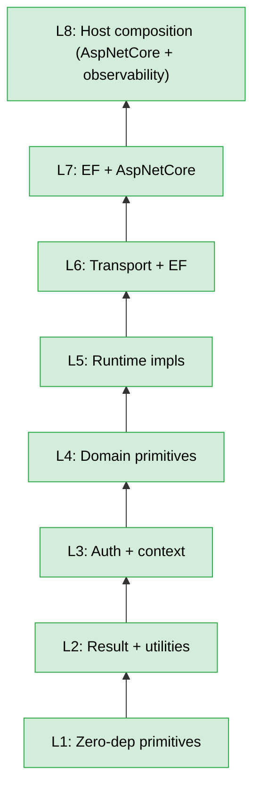

<!--
Copyright (c) DCSV. Licensed under the Apache License, Version 2.0.
-->

# packages/dotnet/ — Shared .NET Libraries

> Parent: [`packages/`](../README.md)

Foundational libraries for D2 .NET hosts and apps. JWT / session runtime middleware is **host-supplied** (not in this repo); this tree ships portable auth vocabulary, catalogs, and source generators.

Per project convention, every library has its own `README.md`. The list below points at each lib's local README. **Status** column indicates whether the lib is built (csproj + sources) or a placeholder shell (folder + README only — awaiting first consumer).

## Table of contents

- [Clusters](#clusters)
- [Libraries](#libraries)
- [Source generators (registry)](#source-generators-registry)
- [Dependency graph (built libs only)](#dependency-graph-built-libs-only)
- [Conventions](#conventions)
- [Build](#build)

## Clusters

Each multi-package cluster has its own index README that lists and briefly describes its constituent packages. The cluster index is the entry point for navigating a concern area; the per-package READMEs carry the full API + codegen + dependency detail.

- [`error-codes/`](error-codes/README.md) — closed `ErrorCategory` enum leaf, merged cross-catalog `ErrorCodeRegistry`, and their source generators
- [`auth/`](auth/README.md) — portable auth vocabulary + catalog source generators (JWT runtime is host-supplied)
- [`caching/`](caching/README.md) — `ILocalCache` / `IDistributedCache` / `ITieredCache` abstractions plus local-memory and Redis implementations
- [`contacts/`](contacts/README.md) — composable PII value objects (`Personal`, `NameAffixes`, `Demographics`, `Professional`, `EmailAddress`, `PhoneNumber`) plus reusable EF Core mapping
- [`context/`](context/README.md) — spec-driven request and auth context interfaces, codegen-driven `PropagatedContext` serialization
- [`data-governance/`](data-governance/README.md) — GDPR anonymization markers, engine seam, and EF Core anonymization engine + startup model guard
- [`encryption/`](encryption/README.md) — AES-256-GCM payload crypto, keyrings, binary frame layout, spec-driven domain and frame-layout source generators
- [`entity-framework-core/`](entity-framework-core/README.md) — generic VO-agnostic EF Core migration helpers (`core/`), PostgreSQL startup **mechanism** (`postgres/` — advisory-lock migrator, `pg_advisory_lock` helper, Npgsql defaults applier), and the spec-driven advisory-lock-key source generator (`locks-source-gen/` — emits into owning-module assemblies)
- [`geo/`](geo/README.md) — spec-driven geographic reference catalogs, name-resolver contracts, in-memory lookup tables
- [`handler/`](handler/README.md) — `BaseHandler<TSelf, TInput, TOutput>`, handler contracts, repo-handler variants, DB-exception classifiers
- [`headers/`](headers/README.md) — per-transport wire-protocol header constant catalogs, codegen-emitted from the headers spec
- [`i18n/`](i18n/README.md) — `TKMessage` primitives, source-gen-emitted `TK.*` constants, runtime translator
- [`location/`](location/README.md) — immutable location value objects (`Coordinates`, `StreetAddress`, `AdminLocation`) plus reusable EF Core mapping
- [`messaging/`](messaging/README.md) — transport-agnostic message bus, default RabbitMQ implementation, spec-driven message / subscription / DLQ / OTel-tag source generators
- [`problem-details/`](problem-details/README.md) — RFC 7807 wire-shape constant catalog, spec-driven source generator
- [`result/`](result/README.md) — `D2Result<T>` core, wire-envelope and error-code source generators
- [`source-gen-shared/`](source-gen-shared/README.md) — cross-source-gen shared scaffolding and multi-target source generators consumed by multiple clusters
- [`telemetry/`](telemetry/README.md) — OpenTelemetry SDK setup, OTLP exporters, Prometheus endpoint, per-meter telemetry-tag source generator

## Libraries

| Lib                                                                                                     | Status      | Purpose                                                                                                                                                                                                                                                                                                                                                                                                                                                                                                                                                                                                                                                                                                                                                                                                                                                                                                                                                                                                                                                                                                                                                                                                                                | Reference                                                               |
| ------------------------------------------------------------------------------------------------------- | ----------- | -------------------------------------------------------------------------------------------------------------------------------------------------------------------------------------------------------------------------------------------------------------------------------------------------------------------------------------------------------------------------------------------------------------------------------------------------------------------------------------------------------------------------------------------------------------------------------------------------------------------------------------------------------------------------------------------------------------------------------------------------------------------------------------------------------------------------------------------------------------------------------------------------------------------------------------------------------------------------------------------------------------------------------------------------------------------------------------------------------------------------------------------------------------------------------------------------------------------------------------- | ----------------------------------------------------------------------- |
| [`result/core/`](result/core/README.md)                                                                 | **Built**   | `D2Result<T>` — errors-as-values, semantic factories, partial-success ladder, `BubbleFail` propagation, auto-injected `traceId`. `Messages` / `InputErrors` are typed as `IReadOnlyList<TKMessage>` (compile-time enforcement: every user-facing message is a translation key). The `ErrorCodes` constants class is codegen-emitted via `source-gen-shared/error-codes-source-gen/` from `contracts/error-codes/error-codes.spec.json` — same spec drives the TS-side `@dcsv-io/d2-result` `ErrorCodes` catalog, so cross-language wire-format drift is structurally impossible.                                                                                                                                                                                                                                                                                                                                                                                                                                                                                                                                                                                                                                                                                 | per-package README D2Result section               |
| [`utilities/`](utilities/README.md)                                                                     | **Built**   | `Truthy()` / `Falsey()` / `ToNullIfEmpty()` / `CleanStr()` / `NormalizeForHash()` + `TryParseEmail()` / `TryParsePhoneNumber()` (return `D2Result<string>` for smart-constructor chaining), `[RedactData]` attribute, `D2Env`, `ConnectionStringHelper`, `SerializerOptions`.                                                                                                                                                                                                                                                                                                                                                                                                                                                                                                                                                                                                                                                                                                                                                                                                                                                                                                                                                                                 | per-package README Utilities section              |
| [`resilience/`](resilience/README.md)                                                                   | **Built**   | `RetryHelper` (with `D2Result`-aware overload), `CircuitBreaker<T>`, `Singleflight<TKey, TValue>`, `TimeoutLayer<TKey, TValue>` (wall-clock deadline; place at two positions for independent total-request and per-attempt deadlines), `RateLimiterLayer<TKey, TValue>` (client-side `SemaphoreSlim` concurrency limiter), and the `ResilientPipeline<TKey, TValue>` composition surface.                                                                                                                                                                                                                                                                                                                                                                                                                                                                                                                                                                                                                                                                                                                                                                                                                                                                                                                                                                                                                                                                      | per-package README Resilience section             |
| [`i18n/abstractions/`](i18n/abstractions/README.md)                                                     | **Built**   | Domain-safe slice — `TKMessage` primitive, SrcGen-emitted `TK` constants from `contracts/messages/en-US.json`, `ITranslator` interface. Zero external deps. Drift between JSON and TK code constants is structurally impossible (the constant doesn't exist if the JSON key doesn't).                                                                                                                                                                                                                                                                                                                                                                                                                                                                                                                                                                                                                                                                                                                                                                                                                                                                                                                                                  | per-package README i18n section                   |
| [`i18n/source-gen/`](i18n/source-gen/README.md)                                                         | **Built**   | Roslyn `IIncrementalGenerator` (netstandard2.0) that emits the `TK.*` constants consumed by `i18n/abstractions/`. Referenced as Analyzer; its dll never ships into any consuming assembly. Lives in the `i18n/` cluster because it has a different TFM and a different consumption pattern from a normal lib.                                                                                                                                                                                                                                                                                                                                                                                                                                                                                                                                                                                                                                                                                                                                                                                                                                                                                                                       | per-package README i18n section                   |
| [`i18n/core/`](i18n/core/README.md)                                                                     | **Built**   | Runtime `Translator` + `SupportedLocales` + `AddD2I18n` DI extension. Used by Courier-style outbound notifications; HTTP responses ship `TKMessage` objects unchanged for client-side translation via SvelteKit/Paraglide.                                                                                                                                                                                                                                                                                                                                                                                                                                                                                                                                                                                                                                                                                                                                                                                                                                                                                                                                                                                                             | per-package README i18n section                   |
| [`auth/abstractions/`](auth/abstractions/README.md)                                                     | **Built**   | Identity / authorization vocabulary AND consumer-side runtime contracts — `OrgType`, `Role`, `ActorKind`, `ImpersonationKind`, `ActionSensitivity`, `ActorEntry`, the SrcGen-emitted `Scopes` / `Audiences` / `JwtClaimTypes` / `D2HttpContextItems` static classes (codegen from `contracts/auth-{scopes,audiences}/` + `contracts/jwt-claims/` + `contracts/in-process-keys/`), plus the read-only `IJwksProvider` / `ISessionLivenessTracker` interfaces and `JwksKeySetSnapshot` record returned by them. Depends on `result/core/` + `i18n/abstractions/` (for `D2Result<T>` returns) + `Microsoft.IdentityModel.Tokens` (for `SecurityKey` on the snapshot). Wire-protocol header constants live in the per-transport `DcsvIo.D2.Headers.{Common,Http,Amqp,Grpc}` catalogs. Consumed by domain code, `context/abstractions/`, `handler/abstractions/`, and the runtime auth lib.                                                                                                                                                                                                                                                                                                                                                            | per-package README Scopes / authorization section |
| [`auth/scopes-source-gen/`](auth/scopes-source-gen/README.md)                                           | **Built**   | Roslyn `IIncrementalGenerator` (netstandard2.0) that emits the `Scopes.*` constants for `auth/abstractions/` from `contracts/auth-scopes/scopes.spec.json`. Referenced as Analyzer; its dll never ships into any consuming assembly.                                                                                                                                                                                                                                                                                                                                                                                                                                                                                                                                                                                                                                                                                                                                                                                                                                                                                                                                                                                                   | per-package README Scopes / authorization section |
| [`auth/audiences-source-gen/`](auth/audiences-source-gen/README.md)                                     | **Built**   | Roslyn `IIncrementalGenerator` (netstandard2.0) that emits the `Audiences.*` const-string catalog for `auth/abstractions/` from `contracts/auth-audiences/audiences.spec.json`. Single source of truth for JWT `aud` claim values + `TokenExchangeClient.ExchangeAsync` `targetAudience` arguments. Referenced as Analyzer.                                                                                                                                                                                                                                                                                                                                                                                                                                                                                                                                                                                                                                                                                                                                                                                                                                                                                                            | per-package README Scopes / authorization section |
| `auth/protocol-audiences-source-gen/`                                                                   | **Built**   | Roslyn `IIncrementalGenerator` (netstandard2.0) that emits `WellKnownAudiences.g.cs` (the bare-token PROTOCOL audiences `d2.internal` / `d2-edge`) into `auth/abstractions/` from `contracts/auth-protocol-audiences/protocol-audiences.spec.json`. Distinct from `Audiences` (URL-shaped token-exchange targets): protocol audiences are the universal-receive / Edge-self `aud` values. The TS side (`ProtocolAudiences` const) is emitted for TypeScript packages (sources committed); the monorepo TypeSpec `@d2Audience` validator accepts a value iff it is in this spec. `D2PAUD` diagnostics. Referenced as Analyzer.                                                                                                                                                                                                                                          | per-package README Scopes / authorization section |
| [`error-codes/category/`](error-codes/category/README.md)                                               | **Built**   | Zero-dependency (BCL-only) leaf — generated `ErrorCategory` enum (nine-value closed classification, e.g. `NotFound` / `ValidationFailure` / `InfrastructureUnavailable`) + `ErrorCategoryWire.ToWire()` / `TryFromWire()` extension methods + `ErrorCategoryJsonConverter` (reads/writes the snake_case wire string; unknown strings throw `JsonException`). Emitted by `error-codes/category-source-gen/` from `contracts/error-category/error-category.spec.json`. Referenced downward by both `error-codes/registry/` (the `ErrorCodeInfo.Category` field) and `result/core/` (the typed `D2Result.Category` field).                                                                                                                                                                                                                                                                                                                                                                                                                                                                                                                                                                                                                                | [error-codes/category](error-codes/category/README.md)                  |
| [`error-codes/registry/`](error-codes/registry/README.md)                                               | **Built**   | Merged cross-catalog error-code registry — generated `readonly record struct ErrorCodeInfo` (8 fields: `Code`, `HttpStatus`, `Category` (`ErrorCategory` enum), `UserMessageKey`, `FactoryName`, `FactoryShape`, `Doc`, `Domain`) + `static class ErrorCodeRegistry` (`TryResolve(code, out info): bool` + `Resolve(code): ErrorCodeInfo?` + `All`). `FrozenDictionary` backing for allocation-free hot-path lookup. Emitted by `error-codes/registry-source-gen/` from all `contracts/*-error-codes/*.spec.json` catalogs + `contracts/error-codes/error-codes.spec.json`. Cross-catalog collision guard emits `D2ERC004` + `D2ERC005` diagnostics at build time; unknown-category guard emits `D2ERC006` / `D2ERC007`. Mirrors `@dcsv-io/d2-error-codes-registry` on the TS side.                                                                                                                                                                                                                                                                                                                                                                                                                                                                 | [error-codes/registry](error-codes/registry/README.md)                  |
| [`source-gen-shared/error-codes-source-gen/`](source-gen-shared/error-codes-source-gen/README.md)       | **Built**   | Roslyn `IIncrementalGenerator` (netstandard2.0) that emits `ErrorCodes.g.cs` (constants + `AllCodes` set + `GetHttpStatus` switch) into `result/core/` from `contracts/error-codes/error-codes.spec.json`. Single source of truth for the generic 15-entry D2Result error-code taxonomy (`NOT_FOUND` / `FORBIDDEN` / `VALIDATION_FAILED` / `PARTIAL_SUCCESS` / `IDEMPOTENCY_IN_FLIGHT` / etc.); same spec drives the TS-side `@dcsv-io/d2-result` `ErrorCodes` catalog (TS catalogs committed). Auth-specific codes (`AUTH_*`) are host-supplied domain catalogs (extra fields such as `factoryName` / `userMessageKey` / `category`) outside this generic taxonomy. Referenced as Analyzer.                                                                                                                                                                                                                                                                                                                                                                                                                                                                                  | per-package README Spec-driven codegen section    |
| [`result/envelope-source-gen/`](result/envelope-source-gen/README.md)                                   | **Built**   | Roslyn `IIncrementalGenerator` (netstandard2.0) that emits `D2ResultEnvelopeFieldNames.g.cs` (8 JSON property-name constants — `SUCCESS` / `DATA` / `MESSAGES` / `INPUT_ERRORS` / `ERROR_CODE` / `TRACE_ID` / `STATUS_CODE` / `CATEGORY` — plus `AllFields` set) into `result/` from `contracts/d2result-envelope/d2result-envelope.spec.json`. Single source of truth for the D2Result Shape B wire envelope (the BFF gateway response shape every frontend reads). The hand-written `D2Result` / `D2Result<TData>` carry `[JsonPropertyName(D2ResultEnvelopeFieldNames.*)]` attributes referencing the codegen constants — the envelope keys ship as camelCase unconditionally, independent of the calling endpoint's `JsonSerializerOptions.PropertyNamingPolicy`. Same spec drives the TS-side `@dcsv-io/d2-result` catalog (TS catalogs committed); gateway/BFF parsers should read via the spec constants instead of hand-rolled string literals. Referenced as Analyzer.                                                                                                                                                                                            | per-package README Spec-driven codegen section    |
| [`problem-details/source-gen/`](problem-details/source-gen/README.md)                                   | **Built**   | Roslyn `IIncrementalGenerator` (netstandard2.0) that emits the static-class `D2ProblemDetailsKeys.g.cs` carrying `TYPE_URI_PREFIX` + `CONTENT_TYPE` + `EXTENSION_*` extension keys + `TITLE_*` per-HTTP-status titles + the `TitleFor` switch into `problem-details/abstractions/` from `contracts/problem-details/problem-details.spec.json`. Single source of truth for the RFC 7807 wire shape consumed by every .NET emit path (host auth middleware path A + public aspnetcore Customizer path B); same spec drives the TS-side `@dcsv-io/d2-problem-details-abstractions` catalog (sources committed) (TS catalogs committed). Referenced as Analyzer.                                                                                                                                                                                                                                                                                                                                                                                                                                                                                                                                                                                                    | per-package README Spec-driven codegen section    |
| [`problem-details/abstractions/`](problem-details/abstractions/README.md)                               | **Built**   | Single home for the codegen-emitted `D2ProblemDetailsKeys` static class — `TYPE_URI_PREFIX`, `CONTENT_TYPE`, `EXTENSION_*`, `TITLE_*`, and the `TitleFor(HttpStatusCode)` switch. Zero runtime deps. Consumed by host auth middleware (path A) AND public `aspnetcore/` (path B — `D2ProblemDetailsCustomizer` over ASP.NET `IProblemDetailsService`) so both emit paths share one constant set and produce byte-identical Shape A bodies.                                                                                                                                                                                                                                                                                                                                                                                                                                                                                                                                                                                                                                                                                                                                       | per-package README Spec-driven codegen section    |
| [`source-gen-shared/wire-shapes-source-gen/`](source-gen-shared/wire-shapes-source-gen/README.md)       | **Built**   | Roslyn `IIncrementalGenerator` (netstandard2.0) with multi-target dispatch — emits per-wire-shape JSON property-name catalog static classes by reading `contracts/<wire-shape>/<wire-shape>.spec.json` files via `<AdditionalFiles>`. Dispatches per consuming assembly: `DcsvIo.D2.I18n.Abstractions` → `TkMessageWireShape.g.cs` (KEY/PARAMS) from `contracts/tk-message/tk-message.spec.json`; `DcsvIo.D2.Result` → `InputErrorWireShape.g.cs` (FIELD/ERRORS) from `contracts/input-error/input-error.spec.json`. The emitted constants are referenced by `TKMessageJsonConverter` and `InputError`'s `[JsonPropertyName]` attributes; same specs drive the TS-side `@dcsv-io/d2-result` catalogs (TS catalogs committed). Aligns `D2Result.messages` to ship as `IReadOnlyList<TKMessage>` on both .NET and TS sides — the spec-driven `{key, params?}` envelope is the single source of truth for the wire shape. Referenced as Analyzer.                                                                                                                                                                                                                                                                           | per-package README Spec-driven codegen section    |
| [`auth/jwt-claims-source-gen/`](auth/jwt-claims-source-gen/README.md)                                             | **Built**   | Roslyn `IIncrementalGenerator` (netstandard2.0) that emits `JwtClaimTypes.g.cs` into `auth/abstractions/` from `contracts/jwt-claims/jwt-claims.spec.json`. Single source of truth for every JWT claim D2 reads / writes (standard OAuth/OIDC + D2-custom + inside-act); same spec drives the TS-side `@dcsv-io/d2-auth-abstractions` `JwtClaimTypes` catalog. Referenced as Analyzer.                                                                                                                                                                                                                                                                                                                                                                                                                                                                                                                                                                                                                                                                                                                                                                                                                                                         | per-package README Scopes / authorization section |
| [`encryption/in-process-keys-source-gen/`](encryption/in-process-keys-source-gen/README.md)                        | **Built**   | Roslyn `IIncrementalGenerator` (netstandard2.0) that emits `D2HttpContextItems.g.cs` (public class) into `auth/abstractions/` (and internal gRPC UserState keys into host gRPC bindings when present) from `contracts/in-process-keys/keys.spec.json`. Cross-binding parity is structurally guaranteed (single source emits both at identical wire values; verified by `HttpContextItemsVsGrpcUserStateKeysConsistencyTests`). Referenced as Analyzer.                                                                                                                                                                                                                                                                                                                                                                                                                                                                                                                                                                                                                                                                                                                                                                                       | per-package README Context section                |
| [`headers/source-gen/`](headers/source-gen/README.md)                                                   | **Built**   | Roslyn `IIncrementalGenerator` (netstandard2.0) that emits per-transport header catalog classes into `headers/{common,http,amqp,grpc}/` from `contracts/headers/headers.spec.json`. Cross-transport entries appear in multiple per-transport catalogs at identical wire values, codegen-guaranteed; same spec drives the TS-side `@dcsv-io/d2-headers-{common,http,amqp,grpc}` packages. Referenced as Analyzer by all four catalog csprojs.                                                                                                                                                                                                                                                                                                                                                                                                                                                                                                                                                                                                                                                                                                                                                                                                   | [messaging/rabbitmq](messaging/rabbitmq/README.md)                      |
| [`headers/common/`](headers/common/README.md)                                                           | **Built**   | Cross-transport D2 wire-protocol headers (`CommonHeaders.PROPAGATED_CONTEXT`, `.TRACEPARENT`, `.TRACESTATE`, `.AUTHORIZATION`). Codegen-emitted from the headers spec via `headers/source-gen/`. Zero runtime dependencies.                                                                                                                                                                                                                                                                                                                                                                                                                                                                                                                                                                                                                                                                                                                                                                                                                                                                                                                                                                                                            | [messaging/rabbitmq](messaging/rabbitmq/README.md)                      |
| [`headers/http/`](headers/http/README.md)                                                               | **Built**   | HTTP-applicable D2 wire-protocol headers (`HttpHeaders.AUTHORIZATION`, `.IDEMPOTENCY_KEY`, `.CLIENT_FINGERPRINT`, `.INTERNAL_TOKEN` + cross-transport entries). Codegen-emitted from the headers spec. Zero runtime dependencies. Single source of truth for the HTTP-transport header catalog consumed by host JWT middleware (and any host that binds HTTP auth).                                                                                                                                                                                                                                                                                                                                                                                                                                                                                                                                                                                                                                                                                                                                                                                                                                                                                                    | [messaging/rabbitmq](messaging/rabbitmq/README.md)                      |
| [`headers/amqp/`](headers/amqp/README.md)                                                               | **Built**   | AMQP-applicable D2 wire-protocol headers (`AmqpHeaders.MESSAGE_ID`, `.PROTO_TYPE`, `.ENCRYPTION_KID`, `.FAILURE_REASON`, `.CONTENT_TYPE`, `.TIMESTAMP` + cross-transport entries). Codegen-emitted from the headers spec. Zero runtime dependencies. Single source of truth for the AMQP-transport header catalog consumed by `messaging/rabbitmq/`.                                                                                                                                                                                                                                                                                                                                                                                                                                                                                                                                                                                                                                                                                                                                                                                                                                                                                   | [messaging/rabbitmq](messaging/rabbitmq/README.md)                      |
| [`headers/grpc/`](headers/grpc/README.md)                                                               | **Built**   | gRPC-applicable D2 wire-protocol headers (`GrpcHeaders.AUTHORIZATION` + cross-transport entries). Codegen-emitted from the headers spec. Zero runtime dependencies. gRPC framework constants (`grpc-status`, `grpc-encoding`, ...) come from `Grpc.Core.Metadata` and are NOT in this catalog.                                                                                                                                                                                                                                                                                                                                                                                                                                                                                                                                                                                                                                                                                                                                                                                                                                                                                                                                         | [messaging/rabbitmq](messaging/rabbitmq/README.md)                      |
| [`telemetry/tags-source-gen/`](telemetry/tags-source-gen/README.md)                                     | **Built**   | Roslyn `IIncrementalGenerator` (netstandard2.0) that emits per-meter `*TelemetryTags.g.cs` typed-constants classes from `contracts/telemetry/telemetry.spec.json`. Per-meter single-target dispatch by `consumingAssembly`. Cross-spec resolution from the AuthErrorCodes spec drives the `d2.auth.problem.emitted` tag-value set. Referenced as Analyzer.                                                                                                                                                                                                                                                                                                                                                                                                                                                                                                                                                                                                                                                                                                                                                                                                                                                                             | per-package README Telemetry section              |
| [`messaging/otel-messaging-tags-source-gen/`](messaging/otel-messaging-tags-source-gen/README.md)       | **Built**   | Roslyn `IIncrementalGenerator` (netstandard2.0) that emits `MessagingActivityTags.g.cs` into `messaging/rabbitmq/` from `contracts/otel-messaging-tags/otel-messaging-tags.spec.json`. Spec-drives the OTel sem-conv attribute-name catalog emitted on both publisher + consumer spans — both sides reference the same `MESSAGING_OPERATION_TYPE` constant, so publisher and consumer spans emit byte-identical OTel canonical attribute names (e.g. `messaging.operation.type`) with no possibility of drift. Same spec drives the TS-side `@dcsv-io/d2-telemetry` `MessagingActivityTags` catalog. Referenced as Analyzer.                                                                                                                                                                                                                                                                                                                                                                                                                                                                                                                                                                                                                   | [messaging/rabbitmq](messaging/rabbitmq/README.md)                      |
| [`encryption/domains-source-gen/`](encryption/domains-source-gen/README.md)                             | **Built**   | Roslyn `IIncrementalGenerator` (netstandard2.0) that emits `EncryptionDomains.g.cs` into `encryption/` from `contracts/encryption-domains/encryption-domains.spec.json`. Single source of truth for the closed catalog of keyring-domain identifiers (`AUDIT` / `NOTIFICATIONS` / `COURIER` + `PLAINTEXT` sentinel). A typo on a domain identifier surfaces as a compile error rather than silently routing a message to a non-existent keyring. Same spec drives the TS-side `@dcsv-io/d2-encryption-abstractions` `EncryptionDomains` catalog. Referenced as Analyzer.                                                                                                                                                                                                                                                                                                                                                                                                                                                                                                                                                                                                                                                                       | [encryption/domains-source-gen](encryption/domains-source-gen/README.md)                   |
| [`encryption/frame-source-gen/`](encryption/frame-source-gen/README.md)                                 | **Built**   | Roslyn `IIncrementalGenerator` (netstandard2.0) that emits `EncryptionFrameLayout.g.cs` into `encryption/` from `contracts/encryption-frame/encryption-frame.spec.json`. Spec-drives the binary frame-layout field-offset + byte-length constants (`VERSION_OFFSET=0`, `KID_LENGTH_OFFSET=1`, `NONCE_LENGTH=12`, `CONSTRAINT_TAG_LENGTH=16`, `CURRENT_VERSION=1`, etc.). Consumed by the TS-side `@dcsv-io/d2-encryption-abstractions` `EncryptionFrame` catalog so the .NET encoder and the TS decoder reference identical byte offsets. Carries a second generator arm `SealedFrameGenerator` that emits `SealedFrameLayout.g.cs` — the sealed-frame layout constants (ephemeral-public-key length-prefix width + allocation cap) for the asymmetric sealed mode. Referenced as Analyzer.                                                                                                                                                                                                                                                                                                                                                                                                                                                                                                                                                                                                                                                                              | [encryption/frame-source-gen](encryption/frame-source-gen/README.md)                   |
| [`messaging/dlq-failure-metadata-source-gen/`](messaging/dlq-failure-metadata-source-gen/README.md)     | **Built**   | Roslyn `IIncrementalGenerator` (netstandard2.0) with multi-target dispatch — emits `DlqFailureMetadataFields.g.cs` (JSON property-name catalog) into `messaging/abstractions/` AND `DlqFailureCauses.g.cs` (closed-enum cause-string catalog) into `messaging/rabbitmq/` from `contracts/dlq-failure-metadata/dlq-failure-metadata.spec.json`. The `DlqFailureMetadata` record uses `[JsonPropertyName(DlqFailureMetadataFields.*)]` referencing the codegen constants — the wire shape ships as camelCase unconditionally, independent of `MessagingJsonOptions`. Same spec drives the TS-side `@dcsv-io/d2-messaging-abstractions` package, so any TS consumer of `@dcsv-io/d2-messaging-abstractions` reads identical field-name and cause-string constants. Referenced as Analyzer by both target csprojs.                                                                                                                                                                                                                                                                                                                                                                                                                                         | [messaging/rabbitmq](messaging/rabbitmq/README.md)                      |
| [`auth/context-abstractions/`](auth/context-abstractions/README.md)                                     | **Built**   | Domain-safe slice of the request context — `IAuthContext` (codegen-emitted from `contracts/auth-context/IAuthContext.spec.json`) plus hand-written `IAuthContextExtensions` (`HasScope`, `IsStaff`, etc.). Lets domain code read caller identity / scopes / impersonation without pulling DI / AspNetCore / Configuration.                                                                                                                                                                                                                                                                                                                                                                                                                                                                                                                                                                                                                                                                                                                                                                                                                                                                                                             | per-package README Context section                |
| [`context/source-gen/`](context/source-gen/README.md)                                                   | **Built**   | Roslyn `IIncrementalGenerator` (netstandard2.0). Reads `contracts/{auth,request}-context/*.spec.json` and emits, per target assembly: `IAuthContext.g.cs` into `auth/context-abstractions/`; `IRequestContext.g.cs` + `MutableRequestContext.g.cs` + `PropagatedContext.g.cs` + `PropagatedContextExtensions.g.cs` + `PropagatedContextSerializer.g.cs` (with per-field `maxLength` validation baked from the spec) into `context/abstractions/`.                                                                                                                                                                                                                                                                                                                                                                                                                                                                                                                                                                                                                                                                                                                                                                                      | per-package README Context section                |
| [`context/abstractions/`](context/abstractions/README.md)                                               | **Built**   | Single-lib home for every spec-driven context primitive. Codegen-emitted: `IRequestContext` interface (extends `IAuthContext`), `MutableRequestContext` concrete, `PropagatedContext` record (the `propagate: true` field subset), `PropagatedContextExtensions` (`ToPropagatedContext` / `ApplyPropagatedContext` projections), `PropagatedContextSerializer` (base64url + JSON codec for the cross-hop `x-d2-context` header, with per-field length caps from the spec). Hand-written RFC helpers ship here too: `ActorChainParser` (RFC 8693 §2.1 nested actor chain, depth-limited strict-mode), `ScopeClaimParser` (RFC 6749 §3.3 SP-only scope string or JSON array). Identity (UserId / OrgId / Scopes / ActorChain) rebuilds from JWT each hop; only the small operational subset propagates.                                                                                                                                                                                                                                                                                                                                                                                                                                  | per-package README Context section                |
| [`handler/abstractions/`](handler/abstractions/README.md)                                               | **Built**   | Domain-safe slice of the handler stack — `IHandler` / `IHandlerContext` interfaces + the `HandlerOptions` record. Lets domain code reference handler contracts without pulling DI / OpenTelemetry / AspNetCore.                                                                                                                                                                                                                                                                                                                                                                                                                                                                                                                                                                                                                                                                                                                                                                                                                                                                                                                                                                                                                        | per-package README Handler section                |
| [`handler/core/`](handler/core/README.md)                                                               | **Built**   | `BaseHandler<TSelf, TInput, TOutput>` + `HandlerContext` + `HandlerTelemetry` + `AddD2Handler` — the runtime piece every handler in every service inherits (CQRS handlers, repo handlers, messaging consumers, scheduled jobs). Auto-emits 4 OTel metrics per call (invoked / succeeded / failed / duration_ms) plus a per-call span via `ActivitySource`. Universal try/catch shape: `ExecuteAsync` exceptions surface as `D2Result.UnhandledException`; `OperationCanceledException` surfaces as `D2Result.Canceled`. `RunCorePipelineAsync` exposes the captured exception so `BaseRepoHandler` can remap EF/PG-specific exceptions to typed `D2Result` failure codes.                                                                                                                                                                                                                                                                                                                                                                                                                                                                                                                                                              | per-package README Handler section                |
| [`handler/repo-abstractions/`](handler/repo-abstractions/README.md)                                     | **Built**   | Vocabulary for repo-flavored handlers — `DbFailureKind` enum + `IDbExceptionClassifier` interface, plus `D2Result` extension factories (`UniqueViolation()`, `IsDeadlock`, etc.) parallel to the built-in semantic factories on `result/`. Pure abstractions: no EF Core, no Npgsql, no provider deps.                                                                                                                                                                                                                                                                                                                                                                                                                                                                                                                                                                                                                                                                                                                                                                                                                                                                                                                                 | per-package README Repository section             |
| [`handler/repo/`](handler/repo/README.md)                                                               | **Built**   | EF-flavored `BaseRepoHandler` — sits on top of `BaseHandler` and converts captured exceptions into typed `D2Result` failures via an injected `IDbExceptionClassifier`. Provider-specific knowledge lives in sibling packages (e.g. `handler/repo-postgres/`); this csproj has zero provider deps.                                                                                                                                                                                                                                                                                                                                                                                                                                                                                                                                                                                                                                                                                                                                                                                                                                                                                                                                      | per-package README Repository section             |
| [`handler/repo-postgres/`](handler/repo-postgres/README.md)                                             | **Built**   | PostgreSQL implementation of `IDbExceptionClassifier`. Plugs into `BaseRepoHandler` via DI (`services.AddD2Postgres()`). Owns the SQLSTATE matrix + the wrapping rules for `DbUpdateException` ↔ `PostgresException` ↔ raw `NpgsqlException`.                                                                                                                                                                                                                                                                                                                                                                                                                                                                                                                                                                                                                                                                                                                                                                                                                                                                                                                                                                                          | per-package README Repository section             |
| [`tests/`](tests/README.md)                                                                             | **Built**   | Test infrastructure for ALL shared libs (deliberately one project — overkill to spin up a separate test csproj for every lightweight lib).                                                                                                                                                                                                                                                                                                                                                                                                                                                                                                                                                                                                                                                                                                                                                                                                                                                                                                                                                                                                                                                                                             | per-package tests README                                                |
| [`time/`](time/README.md)                                                                               | **Built**   | NodaTime wrapper + `IClock` injection seam + `SystemClock` (production) / `TestClock` (deterministic, thread-safe) + Category 1 (`ZonedInstant`) / Category 3 (`LocalAnchoredEvent`) temporal storage records (smart-constructor pattern: private positional ctor + static `Create(...) → D2Result<T>` factory with IANA validation + canonical normalization via TZDB `CanonicalIdMap`) + `LocalAnchoredEvent.ComputeNextFire()` encapsulating NodaTime `LenientResolver` for DST handling + `AddD2NodaTime()` Npgsql EF Core value-converter wiring. Foundation lib in the D2 shared lib dep graph; no DI extension and no `Add*` registration — consumers reference directly and bind `IClock → SystemClock` in their own composition root. NuGet deps: `NodaTime` + `Npgsql.EntityFrameworkCore.PostgreSQL.NodaTime`. D2 deps: `DcsvIo.D2.Result` (smart-constructor `D2Result<T>` return) + `DcsvIo.D2.I18n.Abstractions` (`TK.Common.Time.*` / `TK.Common.Errors.*` validation keys) + `DcsvIo.D2.Utilities` (`Falsey()`/`Truthy()` guards). All near-leaf deps, no cycles.                                                                                                                                                      | per-package README Time section                                        |
| [`logging/`](logging/README.md)                                                                         | **Built**   | Serilog configuration + `RedactDataDestructuringPolicy` enforcement of `[RedactData]` + `UseD2RequestLogging` middleware. Always-on `D2RequestContextEnricher` projects 42 LOG-OK fields off the spec-driven `IRequestContext` (Tracing / Auth-Identity / Auth-Token+Trust / Auth-Org / Auth-Impersonation / Scopes / Trust-Risk / Fingerprints / WhoIs-Geo / WhoIs-Network-Privacy / WhoIs-ASN clusters) onto the request-completion log line; 8 NOT-LOGGED fields (raw IP + sub-country geo + lat/long/geohash) explicitly suppressed and pinned by integration test. Per-source minimum-level overrides (Microsoft.AspNetCore / Microsoft.Extensions.Http / System.Net.Http → Warning; D2 → Debug). `CompactJsonFormatter` console sink + MEL bridge with `writeToProviders: true` so observability infra can additionally route through OTLP log exporter. `AddD2Logging` validates options at host build via `ValidateOnStart` (fail-fast).                                                                                                                                                                                                                                                                                       | per-package README Logging section                |
| [`telemetry/`](telemetry/core/README.md)                                                                | **Built**   | OpenTelemetry SDK setup (traces + metrics + logs) + per-signal OTLP exporters (env-var-gated truthy) + `MapD2PrometheusEndpoint` (IP-restricted to loopback + RFC 1918 private ranges) + AspNetCore / HttpClient / GrpcNetClient / Process / Runtime auto-instrumentations. Aggregates cross-lib `ActivitySource`s / `Meter`s for Handler, Messaging.RabbitMq, Caching.* (hosts may register additional ActivitySource / Meter names) into a single `AddD2Telemetry()` call via `public const string` symbol references for compile-time rename safety, plus spec-pin tests for literal-value drift safety. Honors `OTEL_SDK_DISABLED` symmetrically across `AddD2Telemetry` + `MapD2PrometheusEndpoint`. AspNetCore-instrumentation `Filter` callback excludes infrastructure paths via the canonical `InfrastructurePathMatcher` from `DcsvIo.D2.AspNetCore`; HttpClient instrumentation's self-referential filter prevents infinite-loop instrumentation against the configured OTLP endpoints. The enumerated 4 `ActivitySource`s / 6 `Meter`s include optional host-auth wire literals (`DcsvIo.D2.Auth` / `DcsvIo.D2.Auth.Outbound`); public Telemetry does not ProjectReference host auth packages — hosts register those meters when present.                                                                                                                                                                                                           | per-package README Telemetry section              |
| [`aspnetcore/`](aspnetcore/README.md)                                                                   | **Built**   | Cross-cutting ASP.NET Core middleware + endpoint primitives — `UseD2SecurityHeaders` (OWASP-aligned defaults; HSTS only on HTTPS, preload submission opt-in only because it's a one-way door), `AddD2Cors` + `UseD2Cors` (`D2_DEFAULT` policy reading the canonical indexed `D2_CORS_ORIGINS__*` env-var convention; fail-closed via `ValidateOnStart` on empty origins), `UseD2InfrastructureBypass` (default short-circuit mode invokes the matched endpoint's `RequestDelegate` directly so heavy business middleware does NOT run on cheap probe / metrics / well-known requests), `AddD2ProblemDetails` (RFC 7807 customizer with `traceId` / `correlationId` / `instance` enrichment + 128-char inbound correlation cap), `AddD2HealthChecks` + `MapD2HealthEndpoints` (`/health` full + `/alive` live-tag split), `RunD2ServiceAsync` (PII-safe `Log.Fatal` startup-failure rendering — type FullName + first stack frame only, NEVER `ex.Message`). Owns the public `InfrastructurePathMatcher` (the single source of truth consumed by Logging's request-logging middleware AND Telemetry's AspNetCore-instrumentation `Filter` callback so all three libs stay aligned on the path set without per-lib literal duplication). | per-package README AspNetCore section             |
| [`caching/abstractions/`](caching/abstractions/README.md)                                               | **Built**   | Shared abstractions for the whole cache stack. Three building-block interfaces (`ICacheBasic`, `ICacheAtomic`, `ICacheBroadcast`) are composed by three marker interfaces — `ILocalCache` (basic + atomic, no broadcast — per-process scope), `IDistributedCache` (all three — cluster scope, every read hits remote), `ITieredCache` (all three — L1+L2 composed, reads from L1 first). Distributed and tiered are method-for-method identical; the marker name carries behavioral intent at the dependency site. All ops return `D2Result<T>` / `D2Result`.                                                                                                                                                                                                                                                                                                                                                                                                                                                                                                                                                                                                                                                                          | per-package README Cache section                  |
| [`caching/local-default/`](caching/local-default/README.md)                                             | **Built**   | `DefaultLocalCache : ILocalCache` wraps `Microsoft.Extensions.Caching.Memory.IMemoryCache` for value storage + a `ConcurrentDictionary` for the in-process lock state. Direct method dispatch — no `BaseHandler` (per-call handler overhead would be 100× the ~60ns cache work). Static `Meter` for hit/miss/eviction counters. Always sets `Size=1` per entry so `MaxEntries` enforces a real entry-count cap (mitigates the IMemoryCache SizeLimit footgun).                                                                                                                                                                                                                                                                                                                                                                                                                                                                                                                                                                                                                                                                                                                                                                         | per-package README Cache section                  |
| [`caching/distributed-redis/`](caching/distributed-redis/README.md)                                     | **Built**   | `RedisDistributedCache : IDistributedCache` over StackExchange.Redis — implements all four building blocks (Basic + Atomic + Broadcast + Set). `RedisCacheInvalidationBackplane : ICacheInvalidationBackplane` via Redis pub/sub. `JsonCacheSerializer` default. Internal Lua scripts make compound atomic ops single-round-trip (Increment+TTL, ReleaseLock compare-and-delete, SADD+TTL on first-add). Aggregate `Meter` for hits/misses/sets/removes/broadcasts/errors.                                                                                                                                                                                                                                                                                                                                                                                                                                                                                                                                                                                                                                                                                                                                                             | per-package README Cache section                  |
| [`caching/tiered/`](caching/tiered/README.md)                                                           | **Built**   | `DefaultTieredCache : ITieredCache` composes one `ILocalCache` (L1) + one `IDistributedCache` (L2). L2-first writes (no partial-write states), L1-then-L2 reads with populate-on-L2-hit, atomic ops route through L2 with L1 invalidation as side effect. Subscribes to optional `ICacheInvalidationBackplane` at construction for cluster-wide L1 coherency.                                                                                                                                                                                                                                                                                                                                                                                                                                                                                                                                                                                                                                                                                                                                                                                                                                                                          | per-package README Cache section                  |
| [`messaging/source-gen/`](messaging/source-gen/README.md)                                               | **Built**   | Roslyn `IIncrementalGenerator` (netstandard2.0). Reads `contracts/mq-messages/mq-messages.spec.json` + `contracts/mq-subscriptions/mq-subscriptions.spec.json` and emits `MqMessages.g.cs` + `MqSubscriptions.g.cs` (constants + immutable `MqMessagesRegistry` / `MqSubscriptionsRegistry` lookup tables) into `messaging/abstractions/`. Validates encryption-domain whitelist (against `DcsvIo.D2.Encryption.EncryptionDomains`) at codegen time.                                                                                                                                                                                                                                                                                                                                                                                                                                                                                                                                                                                                                                                                                                                                                                                   | [messaging/rabbitmq](messaging/rabbitmq/README.md)                      |
| [`source-gen-shared/core/`](source-gen-shared/core/) <!-- §11.36 carve-out: shared .cs files only; no README. --> | **Built**   | Shared source-gen scaffolding (NOT a project — no csproj). Holds the netstandard2.0 polyfills (`IsExternalInit` + Falsey/Truthy `StringExt`) plus the cross-source-gen records (`EmitDiagnostic`, `LoadResult<TSpec>`, `SpecFile`). Each `*-source-gen/` csproj wires the files in via `<Compile Include="..\..\source-gen-shared\core\**\*.cs">` so the polyfills + scaffolding can never drift between source-gens (the missing-polyfill bug class is structurally impossible).                                                                                                                                                                                                                                                                                                                                                                                                                                                                                                                                                                                                                                                                                                                                                   | per-package README Spec-driven codegen section    |
| [`messaging/abstractions/`](messaging/abstractions/README.md)                                           | **Built**   | Transport-agnostic surface — `IMessageBus` (+ `WaitForReadyAsync`), `IMessageIdempotencyStore`, `[MqPub(MqMessages.X)]` / `[MqSub(MqSubscriptions.X)]` attributes (default-deny), codegen-emitted `MqMessageDescriptor` / `MqSubscriptionDescriptor` records (+ `TieredRetryDescriptor`), `QueuePattern` enum, `PublisherOptions`, `SubscriberRegistry` + `SubscriberRegistrar`, `MessagingFailures`, `MessagingJsonOptions`, `DlqFailureMetadata`, plus `services.AddD2SubscribersFromAssembly(...)` + programmatic `AddD2Subscriber<TSub, TIn>(MqSubscriptionDescriptor)` escape hatch. Zero transport deps so domain code can attach `[MqPub]` and request `IMessageBus` without dragging in `RabbitMQ.Client`. AMQP wire-protocol header constants live in the per-transport `DcsvIo.D2.Headers.Amqp` catalog.                                                                                                                                                                                                                                                                                                                                                                                                                     | [messaging/rabbitmq](messaging/rabbitmq/README.md)                      |
| [`messaging/rabbitmq/`](messaging/rabbitmq/README.md)                                                   | **Built**   | Default `RabbitMQ.Client 7.x` impl of `messaging/abstractions/`. Singleton bus (per-publish transient scope for keyed crypto + `IRequestContext` snapshot), `ID2Connection` with lazy reconnect loop, bounded publisher channel pool with `IdleTtl` eviction, body composition (typed message JSON, optional AES-256-GCM via `DcsvIo.D2.Encryption` — no envelope wrapper), `MessageWireResolver` (`Type → MqMessageDescriptor` via `[MqPub]` + codegen registry), full W3C `traceparent` / `tracestate` cross-hop propagation, `x-d2-context` header for `PropagatedContext`, publisher confirms + transient-classifier retry, idempotent topology (exchanges + DLX + DLQ + optional retry tiers), per-subscriber `IChannel` + dedicated republish channel (DLQ republish-with-failure-header), in-flight callback drain on disposal, narrow-catch around `BasicAck`, `x-death`-driven `RETRIES_EXHAUSTED` enforcement (filtered by reason), composition-time `WaitForConfirm`↔`PublisherConfirmsEnabled` validation, `CacheIdempotencyStore` over `IDistributedCache` (or operator-provided fake), PII-safe log delegates (`SanitizedExceptionRender`). One-call DI: `AddD2MessagingRabbitMq(...)`.                                  | [messaging/rabbitmq](messaging/rabbitmq/README.md)                      |
| [`encryption/`](encryption/core/README.md)                                                              | **Built**   | `PayloadCryptoKeyring` (immutable, JWKS-style multi-kid, `IDisposable` zeroes key bytes), `IPayloadCrypto` + `PayloadCrypto` (AES-256-GCM, per-call `AesGcm`, AAD bound to the keyring's context bytes), self-describing frame format `[v1][kid_len][kid][nonce:12][cipher+tag]`, typed exception hierarchy, keyed-services DI helper (`AddD2EncryptionFor`), and an opt-in `AddD2EncryptionStartupCheck` that round-trips a sentinel per registered domain at boot. Adds a sealed (asymmetric hybrid) mode — `IPayloadSealer` / `IPayloadOpener` over `RecipientPublicKeyring` / `RecipientPrivateKeyring` — plus a deny-by-default source-provenance guard (`MarkD2EncryptionSource` / `AddD2EncryptionSourceCheck`) that rejects crypto from unmarked registration sources. Pure crypto primitive — knows nothing about domains, message buses, or key fetching.                                                                                                                                                                                                                                                                                                                                                                                                                                                                                                                                                                                                                                                                              | [encryption/core](encryption/core/README.md)                   |
| [`geo/source-gen/`](geo/source-gen/README.md)                                                           | **Built**   | Roslyn `IIncrementalGenerator` (netstandard2.0) with multi-target dispatch — emits geo TYPES (record shapes, `*Code` enums, wrapper structs, `JsonConverter`s, `GeoCatalog` constants) into `geo/abstractions/` AND geo DATA (per-catalog static instances, lookup tables, nested static-class hierarchies, `[ModuleInitializer]`-driven coordinator) into `geo/default/` from the seven spec files under `contracts/geo/`. Referenced as Analyzer; the dll never ships into any consuming assembly.                                                                                                                                                                                                                                                                                                                                                                                                                                                                                                                                                                                                                                                                                                                                   | per-package README Spec-driven codegen section    |
| [`geo/abstractions/`](geo/abstractions/README.md)                                                       | **Built**   | The minimal hand-written geo API surface — `IGeoReference` (lookup contract), `IGeoNameResolver` + `NameNormalizer` + `LevenshteinComparer` (fail-closed cascade resolution for 3rd-party free-form text), `IRequestContextGeoExtensions` (typed accessors over `IRequestContext`'s raw WhoIs strings), `DeprecationInfo` (append-only deprecation marker applied to every reference entity). All spec-derived types (record shapes, enums, wrapper structs, `JsonConverter`s, `GeoCatalog` constants) are codegen-emitted into `Generated/` by `geo/source-gen/`. Zero external deps beyond `DcsvIo.D2.Result` + `DcsvIo.D2.Utilities` + `DcsvIo.D2.Context.Abstractions`. Domain code can ProjectRef here without dragging in catalog data or NodaTime.                                                                                                                                                                                                                                                                                                                                                                                                                                                                              | per-package README Geo section                    |
| [`geo/default/`](geo/default/README.md)                                                                 | **Built**   | The codegen-emitted in-memory geo catalogs PLUS hand-written `DefaultGeoNameResolver` (`IGeoNameResolver` impl over the catalogs — four-pass fail-closed cascade with cache-aside discipline + ambiguity-sentinel pattern) and Default-layer `IRequestContextGeoExtensions` (record-returning wrappers — `request.Country()` returns `Country?`, not `CountryCode?`). Catalogs: per-entity static instances + `FrozenDictionary` lookup tables + nested static-class hierarchies (`Subdivisions.US.NY` / `Locales.en.US` / `Timezones.America.New_York`) + a `[ModuleInitializer]`-driven coordinator (`GeoDataInitializer.Initialize`). Depends on `geo/abstractions/` + `DcsvIo.D2.Utilities` + `DcsvIo.D2.Result` + `DcsvIo.D2.I18n.Abstractions` + `DcsvIo.D2.Context.Abstractions` + `Microsoft.Extensions.DependencyInjection.Abstractions` (for the `AddD2GeoDefault` registration extension).                                                                                                                                                                                                                                                                                                                                  | per-package README Geo section                    |
| [`location/core/`](location/core/README.md)                                                             | **Built**   | Three immutable, content-addressable value objects (`Coordinates`, `StreetAddress`, `AdminLocation`) + `ComposeLocationHash` free function + `IPostalCodeValidator` boundary contract with `DefaultPostalCodeValidator` global-range default. Pure-domain — depends only on `DcsvIo.D2.Geo.Abstractions` + `DcsvIo.D2.Result` + `DcsvIo.D2.Utilities` + `DcsvIo.D2.Validation.Abstractions`; NO `DcsvIo.D2.Geo.Default`, NO NodaTime. Hash output verified via `contracts/location/parity-fixtures.json` parity fixtures.                                                                                                                                                                                                                                                                                                                                                                                                                                                                                                                                                                                                                                                                                                                                                                                                                                                                                                                                                                                                                                                                                                                                                                                                                                                                                                                                                                                                                                                                                                                                                                                                                                                                                                                                                                                                                                                                                                                                                                                                                                                                                                                                                                                                                | per-package README (content-addressable entities) |
| [`validation/abstractions/`](validation/abstractions/README.md)                                         | **Built**   | Cross-language input-validation contracts — `IEmailValidator`, `IPhoneValidator`, `IPostalCodeValidator` (country-aware) — PLUS the codegen-emitted shared field-constraints catalog: `FieldConstraints` (`public const int` field-length / digit-count bounds) + the `NamePrefix` / `NameSuffix` / `BiologicalSex` `byte`-backed string-wire taxonomy enums, emitted by `validation/source-gen/` from `contracts/validation/field-constraints.spec.json`. Each validator returns `D2Result<string>` (normalized value on success; per-field `InputError` keyed with the `common_validation_*_INVALID` translation key on failure). Pure abstractions — no libphonenumber, no postcode dataset. Mirrors the TS-side `@dcsv-io/d2-validation-abstractions` package. Depends on `DcsvIo.D2.Result` + `DcsvIo.D2.Geo.Abstractions` (for `CountryCode`).                                                                                                                                                                                                                                                                                                                                                                                                       | per-package README validation section |
| [`validation/default/`](validation/default/README.md)                                                   | **Built**   | Default email / phone / country-aware postal-code validator implementations — `DefaultEmailValidator` (practical RFC 5321/5322 structural pattern + trim/lowercase normalization), `DefaultPhoneValidator` (libphonenumber-csharp parse + validate + E.164 normalization), `DefaultPostalCodeValidator` (per-country regex from a ported postcode-validator dataset + trim/uppercase normalization). Cross-language behavior pinned against `contracts/validation/fixtures/{email,phone,postcode}.json` parity corpus shared with the TS-side `@dcsv-io/d2-validation`. Depends on `validation/abstractions/` + `DcsvIo.D2.Result` + `DcsvIo.D2.I18n.Abstractions` + `DcsvIo.D2.Utilities` + `libphonenumber-csharp`.                                                                                                                                                  | per-package README validation section |
| [`data-governance/abstractions/`](data-governance/abstractions/README.md)                               | **Built**   | PURE GDPR-anonymization markers + `[Anonymizable]` attribute + engine seam — `IUserOwned`/`IOrgOwned`/`IExemptFromAnonymization`/`IAnonymizationTrackable`, `AnonymizeKind`/`AnonymizationRule`/`AnonymizationOutcome`, `IAnonymizationEngine`. (`AnonymizeTemplateMarker` is the overload-discriminator sentinel enabling the `[Anonymizable(template: "...")]` named-arg form — not a substantive public type.) Zero EF/DI; refs `DcsvIo.D2.Result` + `JetBrains.Annotations` only. The EF engine implementation lives in `data-governance/entity-framework-core/`.                                                                                                                                                                                                                                                                                                                                                                                                                                                                                                                                                                                                                                                                                                                                                                                                                       | [data-governance/abstractions](data-governance/abstractions/README.md)  |
| [`data-governance/entity-framework-core/`](data-governance/entity-framework-core/README.md)             | **Built**   | EF Core metadata layer for GDPR anonymization — the `D2:Anonymize` model-annotation key, C# 14 fluent decoration API (`Anonymize` / `AnonymizeNull` / `AnonymizeEmpty` / `AnonymizeTemplate` on `PropertyBuilder<T>` / `ComplexTypePropertyBuilder<T>` / `OwnedNavigationBuilder<,>` / `ComplexPropertyBuilder<T>`), the `[Anonymizable]` model-finalizing convention (`AnonymizableAttributeConvention`), `ApplyAnonymizationConventions()` on `ModelConfigurationBuilder`, `AnonymizationTierClassifier` (walks `D2:Anonymize`-annotated properties across root scalars / complex sub-properties / owned entities; classifies Tier A / B / C; caches per entity type), `AnonymizationTemplateResolver` (parses / validates / resolves `{FieldName}` tombstone templates), `AnonymizationEngine` (tiered A/B anonymization with idempotency), `AnonymizationModelValidator` (deny-by-default `IHostedService` boot guard that walks the full EF model and fails host startup on any misconfiguration — missing ownership marker, missing `IAnonymizationTrackable`, Tier-C shape, bad template token, attribute without convention, divergent double-declaration, `SetNull` on non-nullable column), and `AddD2DataGovernance` (DI composition root: registers engine + options + validator). Converges the attribute and fluent decoration front-ends onto one `AnonymizationRule` stored as the `D2:Anonymize` EF annotation; fluent wins by Explicit configuration source. Refs `data-governance/abstractions` + `DcsvIo.D2.Utilities` + `Microsoft.EntityFrameworkCore.Relational` (classifier reads `GetColumnName()` / `IsMappedToJson()` / `GetTableName()` — relational-metadata APIs in the Relational assembly) + `Microsoft.Extensions.DependencyInjection.Abstractions` / `Hosting.Abstractions` / `Configuration.Abstractions` / `Configuration.Binder` / `Logging.Abstractions` / `Options` (DI + `IHostedService` + options binding + `ILogger` + `IOptions<T>`).                                                                                                           | [data-governance/entity-framework-core](data-governance/entity-framework-core/README.md) |
| [`contacts/core/`](contacts/core/README.md)                                                             | **Built**   | Six composable, self-redacting PII value objects (`Personal`, `NameAffixes`, `Demographics`, `Professional`, `EmailAddress`, `PhoneNumber`), each constructed through a `Create(...) → D2Result<T>` smart constructor (dumb structural floor using the shared `FieldConstraints` caps; Email/Phone accept an optional caller-injected `IEmailValidator` / `IPhoneValidator`). `Personal` carries a correlation `HashId`. PII properties self-redact via `[RedactData]`. Pure-domain — depends only on `DcsvIo.D2.Result` + `DcsvIo.D2.Validation.Abstractions` + `DcsvIo.D2.Utilities` + `DcsvIo.D2.Geo.Abstractions`; NO Location, NO Entity Framework. Part of the **folded owned-component** design (no contacts DB; the reusable EF mapping ships separately in `DcsvIo.D2.Contacts.EntityFrameworkCore`). See [ADR-0001](../../../public/docs/adrs/0001-contacts-folded-owned-component.md).                                                                                                                                                                                                                                                                                                                                                                                                                                                              | per-package README (immutability rationale)       |
| [`contacts/entity-framework-core/`](contacts/entity-framework-core/README.md)                           | **Built**   | Per-VO complex-type and value-converter mapping helpers for DcsvIo.D2.Contacts VOs. Called from the host's `IEntityTypeConfiguration<T>`; the domain aggregate holds plain VO-typed properties (zero EF references). Multi-field VOs → `ComplexProperty` via `MapPersonal` / `MapNameAffixes` / `MapDemographics` / `MapProfessional`; single-value VOs → value converters via `MapEmailAddress` / `MapPhoneNumber` + a `.Unique(template)` compile-time coupling (no token-free unique path). The `Uri` value converter is encapsulated in the `MapProfessional` helper. Ships NO `DbContext`, NO migrations, NO DI engine. Refs `contacts/core` + `DcsvIo.D2.DataGovernance.EntityFrameworkCore` + `Microsoft.EntityFrameworkCore.Relational`. | [contacts/entity-framework-core](contacts/entity-framework-core/README.md) |
| [`location/entity-framework-core/`](location/entity-framework-core/README.md)                           | **Built**   | Per-VO complex-type and value-converter mapping helpers for the DcsvIo.D2.Location VOs. Called from the host's `IEntityTypeConfiguration<T>`; the domain aggregate holds plain VO-typed properties (zero EF references). Multi-field VOs → `ComplexProperty` via `MapStreetAddress` / `MapAdminLocation` / `MapCoordinates`. Value converters for `SubdivisionCode` (struct) and `CountryCode` (ushort enum) are encapsulated in `MapAdminLocation`; anonymize defaults are written via the fluent `.Anonymize*` API. Ships NO `DbContext`, NO migrations, NO DI engine. Refs `location/core` + `DcsvIo.D2.Validation.Abstractions` (`FieldConstraints.*` caps) + `DcsvIo.D2.DataGovernance.EntityFrameworkCore` + `Microsoft.EntityFrameworkCore.Relational`. | [location/entity-framework-core](location/entity-framework-core/README.md) |
| [`entity-framework-core/core/`](entity-framework-core/core/README.md)                                   | **Built**   | Generic, VO-agnostic EF Core migration helpers. Ships `CreateD2Index<TEntity>` — a `MigrationBuilder` extension that derives the `{ComplexProp}_{Member}` column name from a typed member-selector expression and emits a raw `CreateIndexOperation`. Exists because EF Core 10 cannot declare model-aware indexes on `ComplexProperty` member columns (silently discarded at finalization; EF 11 native). Pure EF migration plumbing — refs `Microsoft.EntityFrameworkCore.Relational` + `DcsvIo.D2.Utilities` (`ThrowIfFalsey` argument guard). No contacts, location, or data-governance dependency. | [entity-framework-core/core](entity-framework-core/core/README.md) |
| [`entity-framework-core/postgres/`](entity-framework-core/postgres/README.md)                           | **Built**   | PostgreSQL-specific EF Core startup **mechanism** shared fleet-wide (every service gets a per-domain DB). Ships `PgAdvisoryLock` (session-scoped `pg_advisory_lock` / `pg_try_advisory_lock` on a dedicated `NpgsqlConnection`, `[MustDisposeResource]`), `AdvisoryLockMigrator<TContext>` (`IHostedService`: ensure-db-exists + blocking-lock + `MigrateAsync`, fail-fast), `DesignTimeDbContextFactoryBase<TContext>` (design-time factory base for module-within-host services with no `Sdk.Web` startup project), and `NpgsqlContextDefaults` (the canonical `UseNpgsql` defaults applier — `AddD2NodaTime` + `CommandTimeout` + `MigrationsAssembly`, deliberately NO `EnableRetryOnFailure` so an execution-strategy reconnect can't drop a session advisory lock). Domain `AdvisoryLocks` catalogs do **not** ship here — they emit into owning-module assemblies via `locks-source-gen/`. Refs `core/` cluster sibling is NOT taken (independent within the cluster); refs `DcsvIo.D2.Time` + `DcsvIo.D2.Utilities` + `Microsoft.EntityFrameworkCore` + `Npgsql.EntityFrameworkCore.PostgreSQL`. | [entity-framework-core/postgres](entity-framework-core/postgres/README.md) |
| [`workload-identity/`](workload-identity/README.md)                                                     | **Built**   | SPIFFE workload-identity grammar (`PackageId` / assembly / root NS = **`DcsvIo.D2.Spiffe`** — SPIFFE-1: not `DcsvIo.D2.WorkloadIdentity` because the package-root NS would collide with domain type `WorkloadIdentity`). `SpiffeWorkloadIdentity` parse/create/emit for SAN form `spiffe://d2.internal/workload/&lt;service&gt;`. Leaf-tier value object — no X.509 handles, no network. Consumed by `aspnetcore` mTLS peer validation and host certificate / workload-issuance wrappers.                                                                                                                                                                                                                                                                                                                                                                                                                                                                                                                                                                                                                                                                                                                                                          | per-package README (SPIFFE grammar)                                     |

## Source generators (registry)

Every spec-driven catalog in the .NET stack ships as a Roslyn
`IIncrementalGenerator` under `<cluster>/<name>/`. The generators emit constants

- registries into one or more consuming assemblies at build time; the dlls
  never ship in any consumer's runtime closure. The full how-to-author guide
  lives in each generator package README.

| Group                      | Source-gen                                                                      | Purpose                                                                                                                                                                                                                                                                                                                                                                                                                                                                                                                                                                                                                                                                                           | Reference                                          |
| -------------------------- | ------------------------------------------------------------------------------- | ------------------------------------------------------------------------------------------------------------------------------------------------------------------------------------------------------------------------------------------------------------------------------------------------------------------------------------------------------------------------------------------------------------------------------------------------------------------------------------------------------------------------------------------------------------------------------------------------------------------------------------------------------------------------------------------------- | -------------------------------------------------- |
| **Auth / scope**           | [`auth/scopes-source-gen/`](auth/scopes-source-gen/README.md)                   | Emits `Scopes.*` nested-const tree into `auth/abstractions/` from `contracts/auth-scopes/scopes.spec.json`.                                                                                                                                                                                                                                                                                                                                                                                                                                                                                                                                                                                       | per-package README           |
| **Auth / scope**           | [`auth/audiences-source-gen/`](auth/audiences-source-gen/README.md)             | Emits `Audiences.*` const-string catalog into `auth/abstractions/` from `contracts/auth-audiences/audiences.spec.json`.                                                                                                                                                                                                                                                                                                                                                                                                                                                                                                                                                                           | per-package README           |
| **Auth / scope**           | `auth/protocol-audiences-source-gen/`                                           | Emits `WellKnownAudiences.g.cs` (protocol audiences `d2.internal` / `d2-edge`) into `auth/abstractions/` from `contracts/auth-protocol-audiences/protocol-audiences.spec.json`.                                                                                                                                                                                                                                                                                                                                                                                                                                                                                                                  | per-package README             |
| **Auth / scope**           | [`auth/jwt-claims-source-gen/`](auth/jwt-claims-source-gen/README.md)                     | Emits `JwtClaimTypes.g.cs` into `auth/abstractions/` from `contracts/jwt-claims/jwt-claims.spec.json`. Same spec drives the TS-side `@dcsv-io/d2-auth-abstractions` catalog.                                                                                                                                                                                                                                                                                                                                                                                                                                                                                                                              | per-package README           |
| **Context / headers**      | [`context/source-gen/`](context/source-gen/README.md)                           | Emits `IAuthContext.g.cs` into `auth/context-abstractions/` AND `IRequestContext.g.cs` + `MutableRequestContext.g.cs` + `PropagatedContext.g.cs` + `PropagatedContextExtensions.g.cs` + `PropagatedContextSerializer.g.cs` into `context/abstractions/` from `contracts/{auth,request}-context/*.spec.json`.                                                                                                                                                                                                                                                                                                                                                                                      | per-package README           |
| **Context / headers**      | [`headers/source-gen/`](headers/source-gen/README.md)                           | Emits per-transport header catalog classes into `headers/{common,http,amqp,grpc}/` from `contracts/headers/headers.spec.json`. Same spec drives the TS-side `@dcsv-io/d2-headers-*` packages.                                                                                                                                                                                                                                                                                                                                                                                                                                                                                                             | [messaging/rabbitmq](messaging/rabbitmq/README.md) |
| **Context / headers**      | [`encryption/in-process-keys-source-gen/`](encryption/in-process-keys-source-gen/README.md)           | Emits `D2HttpContextItems.g.cs` (public class) into `auth/abstractions/` (and internal gRPC UserState keys into host gRPC bindings when present) from `contracts/in-process-keys/keys.spec.json`. Cross-binding parity structurally guaranteed.                                                                                                                                                                                                                                                                                                                                                                                                                                                         | per-package README           |
| **D2Result / error codes** | [`source-gen-shared/error-codes-source-gen/`](source-gen-shared/error-codes-source-gen/README.md) | Emits `ErrorCodes.g.cs` (constants + `AllCodes` + `GetHttpStatus`) into `result/core/` from `contracts/error-codes/error-codes.spec.json`. Same spec drives the TS-side `@dcsv-io/d2-result` catalog.                                                                                                                                                                                                                                                                                                                                                                                                          | per-package README           |
| **D2Result / error codes** | [`error-codes/category-source-gen/`](error-codes/category-source-gen/)          | Emits `ErrorCategory.g.cs` (closed enum + `ErrorCategoryWire` extension methods + `ErrorCategoryJsonConverter`) into `error-codes/category/` from `contracts/error-category/error-category.spec.json`. Diagnostic prefix: `D2ECAT`. BCL-only output; no project-references in the emitted assembly. Referenced as Analyzer.                                                                                                                                                                                                                                                                              | [error-codes/category](error-codes/category/README.md) |
| **D2Result / error codes** | [`error-codes/registry-source-gen/`](error-codes/registry-source-gen/)          | Emits `ErrorCodeRegistry.g.cs` (merged `ErrorCodeInfo` record + `ErrorCodeRegistry` static class) into `error-codes/registry/` from all `contracts/*-error-codes/*.spec.json` catalogs. Diagnostic prefix: `D2ERC` (owns `D2ERC006` malformed-spec + `D2ERC007` unknown-category; extends the `D2ERC004`/`D2ERC005` family from the shared engine). Referenced as Analyzer.                                                                                                                                                                                                                              | [error-codes/registry](error-codes/registry/README.md) |
| **D2Result / error codes** | [`result/envelope-source-gen/`](result/envelope-source-gen/README.md)           | Emits `D2ResultEnvelopeFieldNames.g.cs` (8 JSON property-name constants + `AllFields`) into `result/core/` from `contracts/d2result-envelope/d2result-envelope.spec.json`. Same spec drives the TS-side gateway parser.                                                                                                                                                                                                                                                                                                                                                                                                                                                                                | per-package README           |
| **D2Result / error codes** | [`problem-details/source-gen/`](problem-details/source-gen/README.md)           | Emits `D2ProblemDetailsKeys.g.cs` (RFC 7807 wire shape: `TYPE_URI_PREFIX` / `CONTENT_TYPE` / `EXTENSION_*` / `TITLE_*` / `TitleFor`) into `problem-details/abstractions/` from `contracts/problem-details/problem-details.spec.json`. Same spec drives the TS-side `@dcsv-io/d2-problem-details-abstractions` catalog (sources committed).                                                                                                                                                                                                                                                                                                                                                                                          | per-package README           |
| **Encryption**             | [`encryption/domains-source-gen/`](encryption/domains-source-gen/README.md)     | Emits `EncryptionDomains.g.cs` into `encryption/` from `contracts/encryption-domains/encryption-domains.spec.json`. Single source of truth for the closed keyring-domain catalog (`AUDIT` / `NOTIFICATIONS` / `COURIER` + `PLAINTEXT`).                                                                                                                                                                                                                                                                                                                                                                                                                                                           | per-package README             |
| **Encryption**             | [`encryption/frame-source-gen/`](encryption/frame-source-gen/README.md)         | Emits `EncryptionFrameLayout.g.cs` into `encryption/` from `contracts/encryption-frame/encryption-frame.spec.json`. Spec-drives the binary frame-layout byte offsets + length constants. Same spec drives the TS-side `@dcsv-io/d2-encryption-abstractions` `EncryptionFrame` catalog. A second arm `SealedFrameGenerator` emits `SealedFrameLayout.g.cs` for the sealed-frame layout.                                                                                                                                                                                                                                                                                                                                                                                                                    | per-package README             |
| **Messaging**              | [`messaging/source-gen/`](messaging/source-gen/README.md)                       | Emits `MqMessages.g.cs` + `MqSubscriptions.g.cs` (constants + immutable `Registry` lookup tables) into `messaging/abstractions/` from `contracts/mq-messages/` + `contracts/mq-subscriptions/`. Validates encryption-domain whitelist against the runtime-discovered `EncryptionDomains`.                                                                                                                                                                                                                                                                                                                                                                                                         | [messaging/rabbitmq](messaging/rabbitmq/README.md) |
| **Messaging**              | [`messaging/dlq-failure-metadata-source-gen/`](messaging/dlq-failure-metadata-source-gen/README.md) | Emits `DlqFailureMetadataFields.g.cs` (JSON property-name catalog) into `messaging/abstractions/` AND `DlqFailureCauses.g.cs` (closed-enum cause-string catalog) into `messaging/rabbitmq/` from `contracts/dlq-failure-metadata/dlq-failure-metadata.spec.json`. Same spec drives the TS-side `@dcsv-io/d2-messaging-abstractions` package.                                                                                                                                                                                                                                                                                                                                                              | [messaging/rabbitmq](messaging/rabbitmq/README.md) |
| **Observability**          | [`telemetry/tags-source-gen/`](telemetry/tags-source-gen/README.md)             | Emits per-meter `*TelemetryTags.g.cs` typed-constants classes from `contracts/telemetry/telemetry.spec.json`. Per-meter single-target dispatch by `consumingAssembly`. Cross-spec resolution from the AuthErrorCodes spec drives the `d2.auth.problem.emitted` tag-value set.                                                                                                                                                                                                                                                                                                                                                                                                                     | per-package README           |
| **Observability**          | [`messaging/otel-messaging-tags-source-gen/`](messaging/otel-messaging-tags-source-gen/README.md) | Emits `MessagingActivityTags.g.cs` into `messaging/rabbitmq/` from `contracts/otel-messaging-tags/otel-messaging-tags.spec.json`. Spec-drives the OTel sem-conv attribute-name catalog used by both publisher + consumer spans. Same spec drives the TS-side `@dcsv-io/d2-telemetry` catalog.                                                                                                                                                                                                                                                                                                                                                                                                             | [messaging/rabbitmq](messaging/rabbitmq/README.md) |
| **i18n**                   | [`i18n/source-gen/`](i18n/source-gen/README.md)                                 | Emits the `TK` static class (hierarchical catalog of `TKMessage` constants) into `i18n/abstractions/` from `contracts/messages/*.json` translation catalogs. The original SrcGen pattern this codebase mirrors elsewhere.                                                                                                                                                                                                                                                                                                                                                                                                                                                                         | per-package README           |
| **Wire shapes**            | [`source-gen-shared/wire-shapes-source-gen/`](source-gen-shared/wire-shapes-source-gen/README.md) | Multi-target dispatch — emits per-wire-shape JSON property-name catalog static classes by reading `contracts/<wire-shape>/<wire-shape>.spec.json`. Dispatches by consuming assembly: `DcsvIo.D2.I18n.Abstractions` → `TkMessageWireShape.g.cs`; `DcsvIo.D2.Result` → `InputErrorWireShape.g.cs`. Same specs drive the TS-side `@dcsv-io/d2-result` catalogs.                                                                                                                                                                                                                                                                                                                                              | per-package README           |
| **Geo**                    | [`geo/source-gen/`](geo/source-gen/README.md)                                   | Multi-target dispatch — emits geo TYPES (`Country` / `Subdivision` / `Currency` / `Language` / `Locale` / `Timezone` / `GeopoliticalEntity` record shapes + `CountryCode` / `CurrencyCode` / `LanguageCode` / `GeopoliticalEntityCode` enums + `SubdivisionCode` / `LocaleCode` / `TimezoneCode` wrapper structs + `JsonConverter`s + `GeoCatalog` constants) into `geo/abstractions/` AND geo DATA (per-catalog `*Lookup` static instances + nested static-class hierarchies + `GeoDataInitializer` coordinator) into `geo/default/` from `contracts/geo/*.spec.json`. Same specs drive the TS-side `@dcsv-io/d2-geo-abstractions` + `@dcsv-io/d2-geo-default` packages (TS catalogs committed). | per-package README           |
| **Validation**             | [`validation/source-gen/`](validation/source-gen/README.md)                     | Emits `FieldConstraints.g.cs` (field-length / digit-count `const int` bounds) + `Taxonomy.g.cs` (`NamePrefix` / `NameSuffix` / `BiologicalSex` `byte`-backed string-wire enums) into `validation/abstractions/` from `contracts/validation/field-constraints.spec.json`. Same spec drives the TS-side `@dcsv-io/d2-validation-abstractions` catalog (TS catalogs committed).                                                                                                                                                                                                                                                                                                          | per-package README             |
| **Persistence**            | [`entity-framework-core/locks-source-gen/`](entity-framework-core/locks-source-gen/README.md) → owning-module assembly (host-supplied) | Emits `AdvisoryLocks.g.cs` (one nested `public static class` per database, each with `public const long` lock-key members) into the **owning-module assembly** from `contracts/advisory-locks/advisory-locks.spec.json`. Shared Postgres owns mechanism only; domain constants live with the module. Generator-enforced **per-database key uniqueness** (`D2LCK003`) turns a silent same-keyspace lock collision into a build break. .NET-only — advisory locks are a PostgreSQL server-side primitive with no TS consumer (no parity gap).                                                                                                                                                                                                                                | [entity-framework-core/locks-source-gen](entity-framework-core/locks-source-gen/README.md) |

<!-- §11.36 carve-out: source-gen-shared/ contains only shared .cs files (polyfills + records); no README — directory link is intentional. -->

Shared netstandard2.0 polyfills + cross-source-gen records (`SpecFile`,
`LoadResult`, `EmitDiagnostic`) live in
[`source-gen-shared/core/`](source-gen-shared/core/) — not a csproj; the `.cs` files are
wired into each `*-source-gen/` csproj via `<Compile Include="..\..\source-gen-shared\core\**\*.cs">`
so the polyfills + scaffolding can never drift between source-gens.

## Dependency graph (built libs only)

> **Note — hand-crafted interim.** This layer-cake was produced manually after the previous per-edge Mermaid hairball became unrenderable. The long-term fix is to generate this view from the `<ProjectReference>` graph in the csprojs (same source of truth that governs the actual dep relationships); the hand-maintained graph drifted and broke. Until a generator exists, update the **per-lib table below** whenever a shared lib is added or its direct deps change.

`tests/` is omitted — it depends on every shared lib and nothing depends on it.

### Legend

| Style | Meaning |
| --- | --- |
| **Solid arrow** | `<ProjectReference>` — runtime dep, ships in consumer's `bin/` |
| **Dashed arrow** | `OutputItemType="Analyzer"` — build-time only; dll never ships in consumer's closure |
| **Yellow nodes** | Source-gen analyzers — emit constants/types into the consuming assembly at compile time |
| **Green nodes** | Runtime library |

### Layer-cake diagram

Dependencies flow **upward** (foundation at bottom, composition root at top). Arrows between bands show the allowed dependency direction; individual lib-to-lib edges within a band are in the per-lib table below.



### Per-lib direct `<ProjectReference>` deps (grouped by band)

`tests/` is omitted throughout. Analyzer references (`OutputItemType="Analyzer"`) are shown as _italic_.

#### Layer 1 — Zero-dep primitives

| Lib | Direct deps |
| --- | --- |
| `error-codes/category` | _error-codes/category-source-gen_ |
| `i18n/abstractions` | _source-gen-shared/wire-shapes-source-gen_ |
| `headers/{common,http,amqp,grpc}` | _headers/source-gen_ |
| `problem-details/abstractions` | _problem-details/source-gen_ |
| All source-gen analyzers | `source-gen-shared/core/` shared `.cs` files (via `<Compile Include>`, not a csproj) |

#### Layer 2 — Core result + utilities

| Lib | Direct deps |
| --- | --- |
| `result/core` | `i18n/abstractions` · `i18n/keys` · `error-codes/category` · _source-gen-shared/error-codes-source-gen_ · _source-gen-shared/wire-shapes-source-gen_ · _result/envelope-source-gen_ |
| `i18n/keys` | `i18n/abstractions` · _i18n/source-gen_ |
| `utilities` | `result/core` · `i18n/abstractions` · `i18n/keys` |
| `resilience` | `result/core` |
| `error-codes/registry` | `error-codes/category` · _error-codes/registry-source-gen_ |
| `workload-identity` (`DcsvIo.D2.Spiffe`) | `result/core` · `utilities` |

#### Layer 3 — Auth vocabulary + request context

| Lib | Direct deps |
| --- | --- |
| `auth/abstractions` | `result/core` · `i18n/abstractions` · _auth/scopes-source-gen_ · _auth/audiences-source-gen_ · _auth/protocol-audiences-source-gen_ · _auth/jwt-claims-source-gen_ · _encryption/in-process-keys-source-gen_ |
| `auth/context-abstractions` | `auth/abstractions` · `utilities` |
| `context/abstractions` | `auth/context-abstractions` · `auth/abstractions` · `utilities` · `time` · _context/source-gen_ |
| `i18n/core` | `i18n/abstractions` · `utilities` |

> `context/abstractions` pulls in `time` (Layer 4) — it is the one upward dep in this band. `time`'s own deps are Layer 1/2 primitives only (no cycle); the `InProcessModuleBoundary` / `SystemRequestContextBootstrap` establishment boundaries need `IClock` to timestamp the call-path entry they append.

#### Layer 4 — Domain primitives

| Lib | Direct deps |
| --- | --- |
| `handler/abstractions` | `result/core` · `context/abstractions` |
| `handler/repo-abstractions` | `result/core` · `i18n/core` |
| `encryption/core` | `utilities` · _encryption/domains-source-gen_ · _encryption/frame-source-gen_ |
| `caching/abstractions` | `result/core` · `i18n/abstractions` · `i18n/keys` |
| `messaging/abstractions` | `handler/core` · `encryption/core` · _messaging/source-gen_ · _messaging/dlq-failure-metadata-source-gen_ |
| `geo/abstractions` | `result/core` · `utilities` · `context/abstractions` · _geo/source-gen_ |
| `validation/abstractions` | `result/core` · `geo/abstractions` · _validation/source-gen_ |
| `time` | `result/core` · `i18n/abstractions` · `utilities` |

> `messaging/abstractions` pulls in `handler/core` (Layer 5) — it is the one upward dep in this band. This is a structural constraint: messaging subscribers are typed as `BaseHandler<THandler, TIn, Unit>`, so the constraint type must be visible at the abstractions layer.

#### Layer 5 — Runtime implementations

| Lib | Direct deps |
| --- | --- |
| `handler/core` | `handler/abstractions` · `result/core` |
| `handler/repo` | `handler/repo-abstractions` · `handler/core` · `handler/abstractions` · `result/core` |
| `handler/repo-postgres` | `handler/repo-abstractions` |
| `caching/local-default` | `caching/abstractions` · `utilities` |
| `caching/distributed-redis` | `caching/abstractions` · `utilities` |
| `caching/tiered` | `caching/abstractions` · `result/core` |
| `messaging/rabbitmq` | `messaging/abstractions` · `encryption/core` · `caching/abstractions` · `resilience` · `headers/amqp` · `handler/core` · `result/core` · `i18n/abstractions` · `utilities` · _messaging/otel-messaging-tags-source-gen_ · _messaging/dlq-failure-metadata-source-gen_ |
| `geo/default` | `geo/abstractions` · `utilities` · `result/core` · `context/abstractions` · `i18n/abstractions` · _geo/source-gen_ |
| `validation/default` | `validation/abstractions` · `result/core` · `geo/abstractions` · `utilities` · `i18n/abstractions` |

#### Layer 6 — Domain EF helpers (+ demoted Auth transport bindings live private)

| Lib | Direct deps |
| --- | --- |
| `entity-framework-core/core` | `utilities` |
| `entity-framework-core/postgres` | `utilities` · `time` |
| `data-governance/abstractions` | `result/core` |
| `data-governance/entity-framework-core` | `data-governance/abstractions` · `utilities` |
| `location/core` | `result/core` · `utilities` · `geo/abstractions` · `validation/abstractions` |
| `contacts/core` | `result/core` · `utilities` · `i18n/abstractions` · `geo/abstractions` · `validation/abstractions` |

#### Layer 7 — EF mapping helpers + AspNetCore cross-cutting

| Lib | Direct deps |
| --- | --- |
| `location/entity-framework-core` | `location/core` · `data-governance/entity-framework-core` · `validation/abstractions` |
| `contacts/entity-framework-core` | `contacts/core` · `data-governance/entity-framework-core` |
| `aspnetcore` | `result/core` · `utilities` · `problem-details/abstractions` · `headers/http` · `workload-identity` (`DcsvIo.D2.Spiffe`) |
| `logging` | `aspnetcore` · `context/abstractions` · `utilities` |
| `telemetry/core` | `aspnetcore` · `utilities` · `handler/core` · `messaging/rabbitmq` · `caching/distributed-redis` · `caching/local-default` |

#### Layer 8 — Host composition

Hosts compose AspNetCore + Logging + Telemetry + Handler (and other layers) directly at their composition root. There is no bundled “service defaults” package in this repo.

### Layering rules

- **Abstractions slices stay zero-external-dep.** Domain code references `*/abstractions` freely; runtime concretes (DI, OTel, EF, ASP.NET Core) stay in sibling non-`-abstractions` csprojs.
- **Dependencies flow toward the foundation** — a lib may not reference a lib in a higher band.
- The permitted cross-band exception documented above: `messaging/abstractions → handler/core` (subscriber type constraint).

## Path properties

Repo-root MSBuild properties provide solution-relative paths for items that reference files outside a project’s own tree (`<AdditionalFiles>`, shared source-gen sources, etc.). Prefer those properties over depth-counted `..\..\..` relatives. Packages also import `packages/dotnet/Directory.Build.props` (Apache StyleCop stamp + LICENSE pack).

Useful properties for packages in this tree:

| Property                        | Resolves to (conceptually)                      | Use in                                              |
| ------------------------------- | ----------------------------------------------- | --------------------------------------------------- |
| `$(D2RepoRoot)`                 | repo root                                       | Any cross-tree path computation                     |
| `$(D2PublicContractsRoot)` / contracts root | `contracts/`                          | `<AdditionalFiles>` / `<Content>` specs             |
| `$(D2SourceGenSharedRoot)`      | `packages/dotnet/source-gen-shared/core/`       | Shared source-gen scaffolding compile includes      |
| `$(D2ErrorCodesEmitRoot)`       | `packages/dotnet/source-gen-shared/error-codes-emit/` | Shared error-codes emit sources              |

## Conventions

- **Folder naming**: lowercase outer (`handler/`, `caching/`, `problem-details/`)
- **Project naming**: PascalCase dot-separated (`DcsvIo.D2.Handler.csproj` lives in `handler/`)
- **One handler per file**; consuming apps typically use per-op folders; shared libs keep their own flat layouts
- **Every project has a `README.md`**
- **Update the dep graph above** when adding / removing a shared lib or changing its `<ProjectReference>` set
- **Abstractions slices stay zero-external-dep** so domain code can reference them freely. Runtime concretes (DI, OTel, EF, ASP.NET Core) live in sibling non-`-abstractions` packages.

## Build

```bash
dotnet build D2.Public.slnx        # public libraries solution
```

Each lib registers its DI surface via an `AddXxx(IServiceCollection)` extension method — consuming hosts compose them at the composition root.
