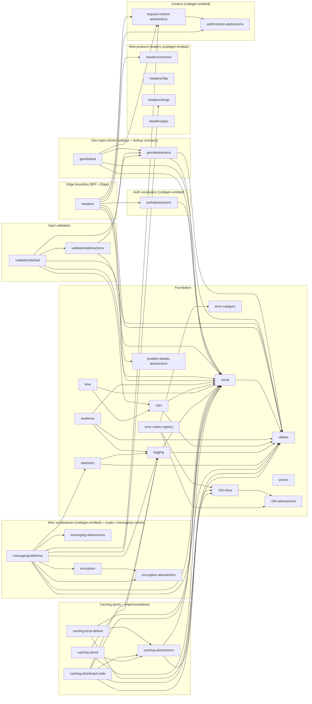

<!--
Copyright (c) DCSV. Licensed under the Apache License, Version 2.0.
-->

# public/packages/typescript/ — Shared TypeScript Libraries

> **Demoted product composition:** `@dcsv-io/d2-private-grpc-client`, `@dcsv-io/d2-private-headers` (BFF guards/core), and `@dcsv-io/d2-private-service-defaults` live under monorepo `private/packages/typescript/`. Header **constant catalogs** remain public under `headers/{common,http,grpc,amqp}/`.

> Parent: [`public/packages/`](../README.md)

Shared TypeScript libraries consumed by SvelteKit BFF and other Node-based services. Most catalogs are codegen-emitted from the same `contracts/` specs that drive the .NET shared libraries — cross-language drift is structurally impossible.

Each package owns its own `README.md` describing its public API, codegen workflow, and dependencies. Generated files (`*.g.ts`) are committed to git and refreshed on every `pnpm -r build` via per-package `prebuild` hooks.

## Clusters

Packages that share enough concern-area cohesion to warrant a cluster-index README. Each index lists and briefly describes the cluster's constituent packages and is the entry point for navigating that concern area.

- [`auth/`](auth/README.md) — codegen-emitted scope / error-code / claim catalogs and the domain-safe auth-context interface
- [`geo/`](geo/README.md) — spec-driven geographic reference data and lookup contracts
- [`headers/`](headers/README.md) — per-transport wire-protocol header constant catalogs (BFF guards/core live under private `@dcsv-io/d2-private-headers`)
- [`caching/`](caching/README.md) — twin of `DcsvIo.D2.Caching.*` — abstractions + local-default + distributed-redis + tiered **Built**; shared backplane channel `d2:cache:invalidations`

## Packages

| Package                                                                   | Status    | Purpose                                                                                                                                                                                                                                                                                                                                                                                                                                                                                                                                                                                                                                                                                                                                                                                                                                                                                                                                                                   | .NET mirror                                                                                                                      |
| ------------------------------------------------------------------------- | --------- | ------------------------------------------------------------------------------------------------------------------------------------------------------------------------------------------------------------------------------------------------------------------------------------------------------------------------------------------------------------------------------------------------------------------------------------------------------------------------------------------------------------------------------------------------------------------------------------------------------------------------------------------------------------------------------------------------------------------------------------------------------------------------------------------------------------------------------------------------------------------------------------------------------------------------------------------------------------------------- | -------------------------------------------------------------------------------------------------------------------------------- |
| [`result/`](result/README.md)                                             | **Built** | `D2Result<T>` shape — errors-as-values, semantic factories, partial-success ladder.                                                                                                                                                                                                                                                                                                                                                                                                                                                                                                                                                                                                                                                                                                                                                                                                                                                                                       | `DcsvIo.D2.Result`                                                                                                               |
| [`utilities/`](utilities/README.md)                                       | **Built** | `falsey()` / `truthy()` / `tryParseTruthyUndefUuid()` / `cleanStr()` and friends.                                                                                                                                                                                                                                                                                                                                                                                                                                                                                                                                                                                                                                                                                                                                                                                                                                                                                         | `DcsvIo.D2.Utilities`                                                                                                            |
| [`resilience/`](resilience/README.md)                                     | **Built** | Retry, circuit breaker, single-flight wrappers (Polly-equivalent).                                                                                                                                                                                                                                                                                                                                                                                                                                                                                                                                                                                                                                                                                                                                                                                                                                                                                                        | `DcsvIo.D2.Resilience`                                                                                                           |
| [`i18n/`](i18n/README.md)                                                 | **Built** | Paraglide-2.x consumer surface; reads `contracts/messages/{locale}.json`.                                                                                                                                                                                                                                                                                                                                                                                                                                                                                                                                                                                                                                                                                                                                                                                                                                                                                                 | `DcsvIo.D2.I18n`                                                                                                                 |
| [`logging/`](logging/README.md)                                           | **Built** | Pino + `ILogger` interface mirroring the .NET shape.                                                                                                                                                                                                                                                                                                                                                                                                                                                                                                                                                                                                                                                                                                                                                                                                                                                                                                                      | `DcsvIo.D2.Logging`                                                                                                              |
| [`telemetry/`](telemetry/README.md)                                       | **Built** | OTLP-over-HTTP setup helper.                                                                                                                                                                                                                                                                                                                                                                                                                                                                                                                                                                                                                                                                                                                                                                                                                                                                                                                                              | `DcsvIo.D2.Telemetry`                                                                                                            |
| [`time/`](time/README.md)                                                 | **Built** | Temporal API wrapper providing `IClock` injection seam + `SystemClock` (production) / `TestClock` (test-injectable) + Category 1 (`ZonedInstant`) / Category 3 (`LocalAnchoredEvent`) temporal storage classes with smart-constructor factories (`ZonedInstant.create()` / `LocalAnchoredEvent.create()` returning `D2Result<T>` with IANA validation via `Intl.DateTimeFormat` + canonical normalization through a `sr_ianaAliasOverrides` map bridging Node Intl ↔ .NET NodaTime `CanonicalIdMap` deltas). `LocalAnchoredEvent.computeNextFire()` uses Temporal's `disambiguation: "compatible"` (matches .NET NodaTime `LenientResolver` — skipped local times map forward, ambiguous local times pick the earlier instant). Polyfilled via `temporal-polyfill@0.3.2` for runtimes without native `Temporal`. Foundation package — no DI wiring; consumers import directly. Cross-language parity verified via `contracts/temporal/temporal-adversarial.fixture.json`. | `DcsvIo.D2.Time`                                                                                                                 |
| [`protos/`](protos/README.md)                                             | **Built** | Buf + `ts-proto` generated types and gRPC stubs from `contracts/protos/`.                                                                                                                                                                                                                                                                                                                                                                                                                                                                                                                                                                                                                                                                                                                                                                                                                                                                                                 | `DcsvIo.D2.Protos`                                                                                                               |
| [`auth/context-abstractions/`](auth/context-abstractions/README.md)       | **Built** | `IAuthContext` interface (codegen from `contracts/auth-context/IAuthContext.spec.json`).                                                                                                                                                                                                                                                                                                                                                                                                                                                                                                                                                                                                                                                                                                                                                                                                                                                                                  | `DcsvIo.D2.AuthContext.Abstractions`                                                                                             |
| [`request-context-abstractions/`](request-context-abstractions/README.md) | **Built** | `IRequestContext` (extends `IAuthContext`) + 1:1 `PropagatedContextSerializer` class (codegen from the request-context spec).                                                                                                                                                                                                                                                                                                                                                                                                                                                                                                                                                                                                                                                                                                                                                                                                                                             | `DcsvIo.D2.RequestContext.Abstractions` + `DcsvIo.D2.Context.Abstractions`                                                       |
| [`auth/abstractions/`](auth/abstractions/README.md)                       | **Built** | Codegen-emitted `Scopes` / `AuthErrorCodes` / `AuthFailures` / `JwtClaimTypes` catalogs.                                                                                                                                                                                                                                                                                                                                                                                                                                                                                                                                                                                                                                                                                                                                                                                                                                                                                  | `DcsvIo.D2.Auth.Abstractions` + `DcsvIo.D2.Auth.Errors` consolidated                                                             |
| [`headers/common/`](headers/common/README.md)                             | **Built** | Cross-transport wire-protocol headers (`PROPAGATED_CONTEXT`, `TRACEPARENT`, `TRACESTATE`, `AUTHORIZATION`). Codegen from `contracts/headers/headers.spec.json`.                                                                                                                                                                                                                                                                                                                                                                                                                                                                                                                                                                                                                                                                                                                                                                                                           | `DcsvIo.D2.Headers.Common`                                                                                                       |
| [`headers/http/`](headers/http/README.md)                                 | **Built** | HTTP-applicable wire-protocol headers (HTTP-only entries + cross-transport entries inline). Codegen from the headers spec.                                                                                                                                                                                                                                                                                                                                                                                                                                                                                                                                                                                                                                                                                                                                                                                                                                                | `DcsvIo.D2.Headers.Http`                                                                                                         |
| [`headers/amqp/`](headers/amqp/README.md)                                 | **Built** | AMQP-applicable wire-protocol headers (AMQP-only entries + cross-transport entries inline). Codegen from the headers spec.                                                                                                                                                                                                                                                                                                                                                                                                                                                                                                                                                                                                                                                                                                                                                                                                                                                | `DcsvIo.D2.Headers.Amqp`                                                                                                         |
| [`headers/grpc/`](headers/grpc/README.md)                                 | **Built** | gRPC-applicable wire-protocol headers. Codegen from the headers spec.                                                                                                                                                                                                                                                                                                                                                                                                                                                                                                                                                                                                                                                                                                                                                                                                                                                                                                     | `DcsvIo.D2.Headers.Grpc`                                                                                                         |
| [`error-category/`](error-category/README.md)                             | **Built** | Foundational zero-dep leaf — closed `ErrorCategory` nine-value string-union + `ErrorCategoryWire` const map + `ALL_ERROR_CATEGORIES` array. Imported by `@dcsv-io/d2-result`, `@dcsv-io/d2-error-codes-registry`, and `@dcsv-io/d2-private-grpc-client (private composition)` so those packages share byte-equal category identifiers without circular deps.                                                                                                                                                                                                                                                                                                                                                                                                                                                                                                                                                                                                                                                                                                         | `DcsvIo.D2.ErrorCodes.Category`                                                                                                  |
| [`error-codes-registry/`](error-codes-registry/README.md)                 | **Built** | Merged cross-catalog error-code registry — generated `errorCodeRegistry` singleton (`resolve(code): ErrorCodeInfo \| undefined` + `has(code): boolean` + `all: readonly ErrorCodeInfo[]`) backed by a frozen `Map`. `ErrorCodeInfo` interface carries 8 fields matching the .NET side: `code`, `httpStatus`, `category` (snake wire string from `@dcsv-io/d2-error-category`), `userMessageKey` (typed `TKMessage` from `@dcsv-io/d2-i18n-keys`), `factoryName`, `factoryShape`, `doc`, `domain`. Emitted by `private/tools/ts-codegen/src/error-codes-registry-emit.ts` from all `contracts/*-error-codes/*.spec.json`. Cross-catalog collision guard fires `D2ERC004`/`D2ERC005` at codegen time.                                                                                                                                                                                                                                                                                                                                  | `DcsvIo.D2.ErrorCodes.Registry`                                                                                                  |
| [`problem-details-abstractions/`](problem-details-abstractions/README.md) | **Built** | Foundational zero-dep leaf — RFC 7807 ProblemDetails wire-format catalog: `PROBLEM_TYPE_URI_PREFIX` + `PROBLEM_DETAILS_CONTENT_TYPE` + `ProblemDetailsExtensionKeys` (`as const` map of the 6 extension-key wire values: `ERROR_CODE` / `MESSAGES` / `INPUT_ERRORS` / `CATEGORY` / `TRACE_ID` / `CORRELATION_ID`) + `ProblemDetailsTitles` (per-status coarse titles) + `defaultTitleForStatus`. Emitted by `private/tools/ts-codegen/src/problem-details-emit.ts` from `contracts/problem-details/problem-details.spec.json`. Re-exported from `@dcsv-io/d2-private-headers (private composition)` for backward-compat.                                                                                                                                                                                                                                                                                                                                                                                                                                      | `DcsvIo.D2.ProblemDetails.Abstractions`                                                                                          |
| [`i18n-abstractions/`](i18n-abstractions/README.md)                       | **Built** | Foundational zero-dep leaf — `TKMessage` shape, `tk()` factory, and the spec-derived `TkMessageWireShape` property-name catalog. Imported by any package that constructs or carries translation messages without pulling in the full i18n runtime.                                                                                                                                                                                                                                                                                                                                                                                                                                                                                                                                                                                                                                                                                                                                                              | `DcsvIo.D2.I18n.Abstractions`                                                                                                    |
| [`i18n-keys/`](i18n-keys/README.md)                                       | **Built** | Thin keys-layer exporting the type-safe `TK` constant catalog (nested `TKMessage` objects keyed by domain and name) and the `TKKey` type alias. Only dependency is `@dcsv-io/d2-i18n-abstractions`; keeps `@dcsv-io/d2-private-grpc-client (private composition)` and other non-i18n-runtime consumers able to reference TK constants without importing the Paraglide runtime.                                                                                                                                                                                                                                                                                                                                                                                                                                                                                                                                                                                                                                                                               | `DcsvIo.D2.I18n.Keys`                                                                                                            |
| [`encryption-abstractions/`](encryption-abstractions/README.md)           | **Built** | Codegen-emitted `EncryptionDomains` (closed-enum keyring-domain identifiers) + `EncryptionFrame` (binary-layout field-offset + byte-length constants). Exposes the catalog so any TS reader (ops tooling, encryption pipelines, on-wire frame consumers) shares byte-equal identifiers with the .NET encoder.                                                                                                                                                                                                                                                                                                                                                                                                                                                                                                                                                                                                                                                             | `DcsvIo.D2.Encryption.EncryptionDomains` + `DcsvIo.D2.Encryption.EncryptionFrameLayout`                                          |
| [`encryption/`](encryption/README.md)                                     | **Built** | Runtime crypto twin — WebCrypto AES-256-GCM (v1 symmetric) + P-256 ECDH-ES → HKDF-SHA256 → AES-256-GCM (v2 sealed), both directions, byte-identical to the .NET encoder (KAT-pinned). `PayloadCrypto`/`PayloadSealer`/`PayloadOpener` + keyrings + a typed failure taxonomy. Consumes the wire-layout constants from `@dcsv-io/d2-encryption-abstractions`.                                                                                                                                                                                                                                                                                                                                                                                                                                                                                                                                                                                                                     | `DcsvIo.D2.Encryption` (runtime core)                                                                                            |
| [`messaging-abstractions/`](messaging-abstractions/README.md)             | **Built** | Codegen-emitted messaging wire catalogs — `DlqFailureMetadataFields` (6 JSON property names) + `DlqFailureCauses` (5 closed-enum cause strings) + the `MqMessages` / `MqMessagesRegistry` descriptor mirror (constant → exchange / exchangeType / encryption / routing-key). Exposes the catalog so any TS reader (DLQ ops tooling, `@dcsv-io/d2-messaging-rabbitmq` subscribers) shares byte-equal identifiers with the .NET producers.                                                                                                                                                                                                                                                                                                                                                                                                                                                                                                                                                                                                                                                                     | `DcsvIo.D2.Messaging.DlqFailureMetadataFields` + `DcsvIo.D2.Messaging.RabbitMq.Subscribing.DlqFailureCauses`                     |
| [`messaging/rabbitmq/`](messaging/rabbitmq/README.md)                     | **Built** | Service-agnostic RabbitMQ runtime (twin of the .NET `DcsvIo.D2.Messaging.RabbitMq` path) — **both** the consumer and the auto-encrypting publisher. Declares the exact .NET topology (primary + `{q}.dlx` + `{q}.dlq` + retry tiers), manual-ack consume, DLQ republish-with-`DlqFailureMetadata`, an `IMessageIdempotencyStore` seam (precise 5-point contract), consume-side context establishment (traceparent-parented span + `x-d2-context` apply; identity / origin never from the wire), and reconnect. The body-compose/decompose seams carry real crypto: a mode-aware `CryptoBodyOpener` (sealed → v2 open, symmetric → v1 decrypt, plaintext-on-encrypted-domain → fail-loud DLQ) and the fused auto-encrypting `createPublisher` where composition is the only path to the socket (plaintext-to-an-encrypted-domain is a compile error). Runtime deps: `rabbitmq-client` + `@dcsv-io/d2-encryption`. | `DcsvIo.D2.Messaging.RabbitMq` (consumer + publisher) |
| [`geo/abstractions/`](geo/abstractions/README.md)                         | **Built** | The minimal hand-written geo API surface — `IGeoReference` (lookup contract), `IGeoNameResolver` + `nameNormalizer` + `levenshteinComparer` (fail-closed cascade resolution for 3rd-party free-form text), `DeprecationInfo`. All spec-derived types (record shapes, `Code`-suffixed branded types, wrapper types, Zod refinements, `GeoCatalog` constants) are codegen-emitted into `src/generated/` by `private/tools/ts-codegen/src/geo-emitter/` from the same seven `contracts/geo/*.spec.json` pipeline-assembled spec files that drive the .NET side.                                                                                                                                                                                                                                                                                                                                                                                                                      | `DcsvIo.D2.Geo.Abstractions`                                                                                                     |
| [`geo/default/`](geo/default/README.md)                                   | **Built** | The codegen-emitted in-memory geo catalogs — per-entity records exposed as typed `Record<TCode, TRecord>` (Countries / Currencies / Languages / GeopoliticalEntities) + nested objects (`Subdivisions.US.NY`, `Locales.en.US`, `Timezones.America.New_York`) + flat lookup maps + a one-time module-init coordinator that wires cross-catalog nav refs after every catalog's first pass completes. Two-pass populate pattern mirrors the .NET side. Per-catalog sub-path exports (`@dcsv-io/d2-geo-default/countries`, `@dcsv-io/d2-geo-default/subdivisions`, ...) so bundlers can tree-shake away unused catalogs.                                                                                                                                                                                                                                                                                                                                                                      | `DcsvIo.D2.Geo.Default`                                                                                                          |
| [`validation/abstractions/`](validation/abstractions/README.md)         | **Built** | Cross-language input-validation contracts — `IEmailValidator`, `IPhoneValidator`, `IPostalCodeValidator` (country-aware) — PLUS the codegen-emitted shared field-constraints catalog: `FieldConstraints` (plain numeric `as const` field-length / digit-count bounds) + the `NamePrefix` / `NameSuffix` / `BiologicalSex` taxonomy enums (string-valued `as const` objects with branded types + Zod `z.enum([...])` schemas + `ALL_*_SET` membership sets), emitted by `private/tools/ts-codegen/src/field-constraints-emit.ts` from `contracts/validation/field-constraints.spec.json`. Each validator returns `D2Result<string>` (normalized value on success; per-field `InputError` keyed with the `common_validation_*_INVALID` translation key on failure). Pure interfaces (validators) — no libphonenumber, no postcode dataset. Depends on `zod` (for the emitted schemas).                                                                                                                                                                                                                                                                                                                                                                                                                                                                                                                                                                                                                                                            | `DcsvIo.D2.Validation.Abstractions`                                                                                            |
| [`validation/default/`](validation/default/README.md)                   | **Built** | Default email / phone / country-aware postal-code validators backed by `libphonenumber-js` + a ported postcode-validator dataset — `DefaultEmailValidator` (practical RFC 5321/5322 structural pattern + trim/lowercase), `DefaultPhoneValidator` (parse + validate + E.164 normalization), `DefaultPostalCodeValidator` (per-country regex + trim/uppercase). Cross-language behavior pinned against `contracts/validation/fixtures/{email,phone,postcode}.json` parity corpus shared with the .NET-side `DcsvIo.D2.Validation`.                                                                                                                                                                                                                                                                                                                                                          | `DcsvIo.D2.Validation`                                                                                                         |
| [`caching/abstractions/`](caching/abstractions/README.md)                 | **Built** | Marker + building-block cache ports — `ICacheBasic` / `ICacheAtomic` / `ICacheBroadcast` / `ICacheSet` + markers `ILocalCache` / `IDistributedCache` / `ITieredCache` + `ICacheInvalidationBackplane` + serializer seam + `InputFailures` / `LOCAL_CACHE_DEFAULTS`; every op returns `D2Result`. | `DcsvIo.D2.Caching.Abstractions` |
| [`caching/local-default/`](caching/local-default/README.md)               | **Built** | In-process L1 + atomics (no broadcast). | `DcsvIo.D2.Caching.Local.Default` |
| [`caching/distributed-redis/`](caching/distributed-redis/README.md)       | **Built** | Redis distributed cache + invalidation backplane — Basic/Atomic/Broadcast/Set; default invalidation channel `d2:cache:invalidations` (shared with .NET). | `DcsvIo.D2.Caching.Distributed.Redis` |
| [`caching/tiered/`](caching/tiered/README.md)                             | **Built** | L1+L2 composition — L2-first writes, `*AndBroadcast*`, everyone-acts L1 drop. | `DcsvIo.D2.Caching.Tiered` |

## Dependency graph

The chart below shows the workspace `package.json` dep graph (runtime `dependencies` only — devDeps are workspace-wide pins).



**Reading the chart**

- All Foundation, Context, Auth-vocabulary, Headers, and Wire-vocabulary packages are **codegen-emit-only** for their wire constants OR pure runtime helpers — none has internal sub-libraries.
- The 4 `headers-*` packages have ZERO runtime deps (pure constants); the analyzer is `private/tools/ts-codegen/src/headers-emit.ts`.
- `auth-abstractions` has one runtime dep (`@dcsv-io/d2-result` — the `D2Result` shape returned by `AuthFailures.*` factories).
- `request-context-abstractions` re-exports types from `auth-context-abstractions` + ships the 1:1 `PropagatedContextSerializer` class from the same spec the .NET side uses.
- The `WIRE` subgraph holds the 2 cross-language wire-vocabulary packages plus the 2 runtime packages that consume them. `@dcsv-io/d2-encryption-abstractions` (codegen `EncryptionDomains` closed-enum + `EncryptionFrame` binary-layout constants exposed for ops tooling and any TS reader of the on-wire encryption frame) and `@dcsv-io/d2-messaging-abstractions` (codegen `DlqFailureMetadataFields` JSON property-name catalog + `DlqFailureCauses` closed-enum exposed for DLQ ops tooling and any TS RabbitMQ subscriber) are pure-constant packages with zero runtime deps. `@dcsv-io/d2-encryption` is the runtime crypto core (WebCrypto AES-256-GCM v1 symmetric + P-256 ECDH-ES sealed v2, KAT-pinned byte-for-byte to the .NET encoder) and depends only on `@dcsv-io/d2-encryption-abstractions`. `@dcsv-io/d2-messaging-rabbitmq` is the service-agnostic consumer + auto-encrypting-publisher runtime; it depends on `@dcsv-io/d2-encryption` for the body compose/decompose seams, on `@dcsv-io/d2-messaging-abstractions` + `@dcsv-io/d2-encryption-abstractions` for the wire catalogs, and on the foundation packages (`@dcsv-io/d2-result`, `@dcsv-io/d2-logging`, `@dcsv-io/d2-telemetry`, `@dcsv-io/d2-utilities`, `@dcsv-io/d2-request-context-abstractions`, `@dcsv-io/d2-headers-amqp`).
- BFF↔Edge glue packages (`@dcsv-io/d2-private-headers`, `@dcsv-io/d2-private-grpc-client`) live under monorepo `private/packages/typescript/` — not public Built roots.
- TypeSpec IDL factory packages and the dual-runtime contract-tests harness live under the monorepo **private** tree (`private/packages/typescript/typespec-*`, `contract-tests`) — not open public roots (§27).

## Codegen workflow

Each codegen-driven package has a `prebuild` script that runs `scripts/run-ts-codegen.mjs`, which invokes the monorepo `ts-codegen` factory when present. On a public OSS clone the factory is not shipped — prebuild **skips** regen and `tsc` uses **committed** `*.g.ts`. Generated files stay in git so `pnpm install` + build works without monorepo tools.

The single source of truth for every spec-driven catalog is the matching `contracts/<topic>/` JSON spec — same spec drives the .NET SourceGen too. Constant catalogs that cross language boundaries are codegen-emitted from a single spec, never hand-mirrored — drift is structurally impossible.

## Conventions

- **Folder naming**: lowercase, nested for grouped packages (`headers/http/`, `auth/abstractions/`).
- **Package naming**: `@dcsv-io/d2-<folder>` (e.g. `@dcsv-io/d2-headers-http`).
- **Every package has a `README.md`** describing its public API + codegen workflow + dependencies.
- **Every codegen-emitted package excludes `*.g.ts` from coverage thresholds** in `vitest.config.ts` — coverage is provided by per-VALUE pin tests in the package + emitter snapshot tests in `private/tools/ts-codegen/`.
- **All packages are `private: true`** — no npm publish.

## Convention divergences from .NET

The two sides aim for the same conceptual grouping, but where a side has only one
package in a concept it stays flat — forcing parity by creating empty folders is an
anti-pattern. The tolerated divergences:

| .NET-side                                                          | TS-side                              | Why divergence                                                                                       |
| ------------------------------------------------------------------ | ------------------------------------ | ---------------------------------------------------------------------------------------------------- |
| `result/{core, envelope-source-gen}/` (+ private Auth grpc-trailers SG)    | `result/` (flat, single pkg)         | TS has no source-gen siblings — codegen lives in `private/tools/ts-codegen/`.                                 |
| `context/{abstractions, source-gen}/`                              | `request-context-abstractions/` (flat) | Same root cause — no TS-side source-gen pkg analogue.                                                |
| `headers/{amqp, common, grpc, http, source-gen}/` (+ private headers-core)            | `headers/{amqp, common, grpc, http}/` (public catalogs; core is private) | TS-side has multi-transport pkgs (matching .NET) but no source-gen sibling. |
| `encryption/{core, domains-source-gen, frame-source-gen, in-process-keys-source-gen}/` | `encryption-abstractions/` + `encryption/` | TS ships both the abstractions and the runtime crypto core; the remaining gap is the source-gen siblings — TS codegen lives in `private/tools/ts-codegen/`.              |
| `messaging/{abstractions, rabbitmq, source-gen, dlq-failure-metadata-source-gen, otel-messaging-tags-source-gen}/` | `messaging-abstractions/` (flat) + `messaging/rabbitmq/` | TS ships the abstractions + a full RabbitMQ runtime (consumer AND the fused auto-encrypting publisher); the remaining gap is the source-gen siblings — TS codegen lives in `private/tools/ts-codegen/`. |
| `protos/contracts/protos/` (NOT under `shared/dotnet/`)            | `protos/` (flat)                     | .NET-side proto compilation lives under `contracts/`; TS protos workspace is a flat pkg.             |
| (no shared `grpc-client/` on public surface) | private `@dcsv-io/d2-private-grpc-client` | .NET clients are per-service; TS gRPC client wrapper is private composition. |

## Build

```bash
pnpm install                         # install workspace deps (lockfile-pinned)
pnpm -r --filter "./public/packages/typescript/**" --filter "./private/tools/ts-codegen" run build   # builds + runs prebuild codegen
pnpm -r --filter "./public/packages/typescript/**" --filter "./private/tools/ts-codegen" run test    # runs vitest in every package
```
